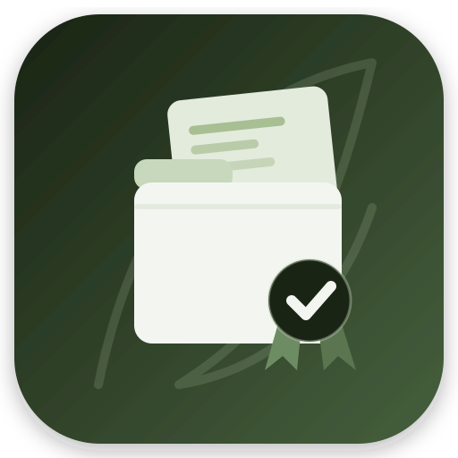

<p align="center">
  
</p>

<h1 align="center">ÁTICA Calidad</h1>

<p align="center">
  Gestión documental de apoyo al sistema de gestión de la calidad en centros educativos
</p>

<p align="center">
  <strong>v0.3.0</strong> &nbsp;·&nbsp;
  <a href="docs/manual/index.md">Documentación</a> &nbsp;·&nbsp;
  <a href="CHANGELOG.md">Cambios</a> &nbsp;·&nbsp;
  <a href="CONTRIBUTING.md">Contribuir</a> &nbsp;·&nbsp;
  <a href="SECURITY.md">Seguridad</a> &nbsp;·&nbsp;
  <a href="http://www.gnu.org/licenses/agpl.html">AGPL-3.0</a>
</p>

<p align="center">
  
  
  
</p>

---

ÁTICA Calidad es una aplicación web desarrollada con [Symfony] para servir de apoyo al **sistema de
gestión de la calidad (SGC)** de un centro educativo: un lugar centralizado donde organizar su
documentación, sus plazos y sus responsables, con acceso diferenciado por docente y por centro.

Es **multi-centro**: un mismo servidor puede alojar varios centros educativos con datos completamente
separados. Cada docente accede únicamente a los datos del centro que tiene asignado, y los
administradores globales pueden gestionar todos los centros desde la sección **Administración**.

### Funcionalidades

- **Árbol documental** — estructura de secciones anidables con carpetas restringibles por
  perfil (responsables, subida, visibilidad y revisión). Documentos con historial de revisiones
  numeradas, flujo opcional de visto bueno (aprobar/rechazar antes de que una revisión pase a
  activa), subida por arrastrar y soltar, y búsqueda en tres niveles (global, por sección y
  paleta de comandos **⌘K**). Exportación e importación completa del árbol en JSON.
- **Responsabilidades** — listas jerárquicas de nombres propias del centro (grupos, departamentos,
  materias…) con etiquetas heredables; **perfiles específicos** (tutorías, jefaturas…) que generan
  un **subperfil** automático por cada elemento de una lista; y una vista transversal para asignar
  docentes a perfiles. Importación de grupos y materias desde **Séneca** (CSV) con previsualización
  de altas, bajas y reactivaciones.
- **Actividades** — plazos y tareas periódicas del sistema de calidad, agrupados en categorías del
  centro, con lista personal (progreso, filtros y buscador), ámbito por perfil o individual, y
  compleción manual o mediante la entrega de un documento del árbol con el mismo flujo de
  aprobación que una revisión.
- **Calendario** — eventos de centro (generales o restringidos a perfiles/subperfiles) y días no
  lectivos, con los plazos de las actividades integrados en el detalle de cada día.
- **Avisos por correo electrónico** — configurables a nivel global, de centro y personal (documento
  pendiente de revisar, aceptado o rechazado, actividad pendiente), en modo individual o resumen
  diario, con campana de notificaciones en la cabecera.
- **Panel principal** — resumen de las revisiones y actividades pendientes de cada docente y, para
  responsable de calidad y administración, de todo el centro.
- **Administración** — cursos académicos, docentes, perfiles de responsable de calidad y auditor/a
  interno/a, motor de ajustes (global/centro/personal), registro de avisos y copias de seguridad.

La sección **Informes** todavía está vacía; el resto de la aplicación está operativa. Ver
[CHANGELOG.md](CHANGELOG.md) para el detalle de cada versión.

Consulta [CONTRIBUTING.md](CONTRIBUTING.md) para la guía de contribución, [CHANGELOG.md](CHANGELOG.md)
para el historial de cambios y [SECURITY.md](SECURITY.md) para reportar vulnerabilidades.

### Stack tecnológico

- **Backend**: [Symfony] 8 / PHP 8.4+, Doctrine ORM (PostgreSQL, MySQL/MariaDB o SQLite), Symfony
  Messenger para tareas asíncronas.
- **Frontend**: Symfony UX (Live Components, Autocomplete, Icons) y Tailwind CSS, sin build de
  JavaScript aparte del Asset Mapper nativo de Symfony.
- **PDF**: mPDF, con plantilla de membrete configurable por centro.
- **Despliegue**: [FrankenPHP](https://frankenphp.dev) (servidor de aplicaciones embebido) vía Docker
  o binario nativo autocontenido.

---

## Documentación

La documentación detallada vive en el **[manual de ÁTICA Calidad](docs/manual/)** (`docs/manual/`),
que es la fuente de referencia principal. Cubre instalación, roles y permisos, cada sección de la
aplicación, ajustes, comandos de consola y despliegue.

El manual se redacta en Markdown y se genera en dos formatos con el mismo contenido:

- **PDF**: `make docs-pdf` → `docs/manual/atica-calidad-manual.pdf`.
- **Web navegable** (con buscador): `make docs-web` / `make docs-serve`.

Capítulos:

| Capítulo | Contenido |
|----------|-----------|
| Introducción | Qué es ÁTICA Calidad y cómo usar el manual |
| Instalación y puesta en marcha | Modos de despliegue y requisitos |
| Preparar el curso académico | Configurar el centro y el curso académico |
| Calendario | Navegación, eventos de centro y días no lectivos |
| Informes | (todavía sin contenido) |
| Administrar el centro educativo | Referencia de cada sección del hub de centro |
| Responsabilidades | Listas jerárquicas, etiquetas, perfiles específicos con subperfiles e importación desde Séneca |
| Árbol documental | Secciones, carpetas, documentos, revisiones y flujo de visto bueno |
| Actividades | Plazos y tareas periódicas, entregas y compleción |
| Administrar la plataforma | Administración global, ajustes, correo, copias de seguridad |
| Permisos de un vistazo | Perfiles y tabla de permisos |
| Resolución de problemas | Soluciones a las dudas más habituales |
| Glosario | Términos del manual y de la aplicación |

---

## Inicio rápido

```bash
cp .env.example .env.local            # edita APP_SECRET y DB_PASSWORD
export COMPOSE_ENV_FILES=.env.local   # Compose usará .env.local (no el .env versionado)
docker compose up -d
```

Accede a **http://localhost** con `admin` / `admin`.

Para el resto de modos de despliegue (binario nativo, Plesk, Ubuntu Server y desarrollo local) y su
configuración detallada, consulta el capítulo
[Instalación y puesta en marcha](docs/manual/01-instalacion-y-puesta-en-marcha.md) del manual.

---

## Requisitos

| Modo | Requisitos |
|------|-----------|
| Docker | Docker Engine 24+ y Docker Compose v2 |
| Desarrollo local | PHP 8.4+, Composer, PostgreSQL 16+, MySQL 8+ / MariaDB 11+ o SQLite |

---

## Desarrollo local

Requisitos: PHP 8.4+, Composer y Docker Compose (solo para la base de datos).

```bash
# 1. Clona el repositorio y copia el entorno
cp .env.example .env.local            # ajusta si es necesario
export COMPOSE_ENV_FILES=.env.local   # Compose usará .env.local

# 2. Levanta PostgreSQL con el overlay de desarrollo
docker compose -f compose.yaml -f compose.dev.yaml up -d

# 3. Instala dependencias e inicializa la base de datos
composer install
make migrate
php bin/console app:setup

# 4. Arranca el servidor de desarrollo
symfony server:start          # o: php -S localhost:8000 -t public/
```

Accede a **https://localhost:8000** (o **http://localhost:8000** con `php -S`) con `admin` / `admin`.

> **Atajo:** una vez instaladas las dependencias y la base de datos (pasos 1-3), `make dev`
> levanta los contenedores de desarrollo (PostgreSQL) y arranca `symfony serve`
> de una vez. `make dev-stop` detiene los contenedores. Requiere `.env.local` y la Symfony CLI.

> El overlay `compose.dev.yaml` (que se combina con `-f`) expone PostgreSQL en el puerto 5432 y deja los servicios `app` y `worker` tras el perfil `production`, de modo que el comando anterior solo arranca la base de datos. En producción se usa únicamente `compose.yaml` (`docker compose up -d`), que sí levanta la aplicación con FrankenPHP.

### Ejecutar los tests

```bash
make test
```

### Análisis estático

```bash
php vendor/bin/phpstan analyse
```

### Generar la presentación

El proyecto incluye una presentación de introducción a ÁTICA Calidad en
[`docs/slides/`](docs/slides/), escrita en [Marp]. Para exportarla a PDF:

```bash
make slides
```

El comando requiere **Node.js** (usa `npx @marp-team/marp-cli`, sin instalación global) y genera
`docs/slides/atica-calidad.pdf`. Cambiando la extensión de salida puedes obtener otros formatos
(`.pptx`, `.html`). Consulta [`docs/slides/README.md`](docs/slides/README.md) para más detalles.

### Generar el manual

El [manual de ÁTICA Calidad](docs/manual/) se redacta en Markdown (`docs/manual/`) y se compila a
PDF y a una web navegable:

```bash
make docs-pdf    # PDF -> docs/manual/atica-calidad-manual.pdf
make docs-web    # web -> docs/manual-site/
make docs-serve  # previsualización en http://127.0.0.1:8000
make docs        # PDF + web
```

El PDF requiere **pandoc** y **Node.js** (usa `npx pagedjs-cli`, el mismo motor Chromium que las slides).
La web requiere **MkDocs Material** (`pip install -r docs/manual/requirements.txt`). Consulta
[`docs/manual/README.md`](docs/manual/README.md) para más detalles.

---

## Licencia

Esta aplicación se ofrece bajo licencia [AGPL versión 3] — consulta el fichero [`LICENSE`](LICENSE) para
el texto completo.

[Symfony]: http://symfony.com/
[Marp]: https://marp.app
[AGPL versión 3]: http://www.gnu.org/licenses/agpl.html
