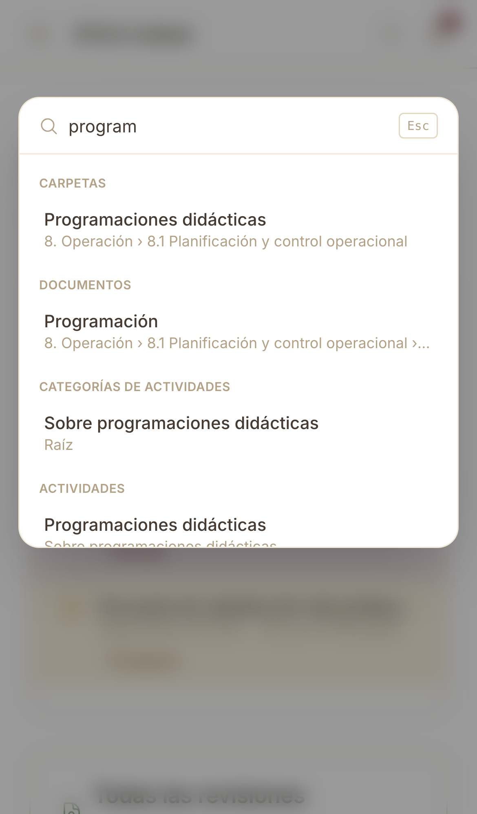

ÁTICA Calidad · Ficha rápida

# Buscar con la paleta de comandos

  1
  

    
Toca la lupa del encabezado —o pulsa <strong>⌘K</strong> / <strong>Ctrl+K</strong> en el ordenador— desde cualquier pantalla.

    
  

  2
  

    
Sin escribir nada ya tienes un acceso directo: cambio de curso académico.

  

  3
  

    
Escribe al menos 2 letras. Los resultados salen agrupados por tipo: carpetas, documentos,
    categorías de actividades, actividades…

    
  

  4
  

    
Busca a la vez en el árbol documental (secciones, carpetas y documentos, incluido el perfil de
    subida y quién subió la última revisión), en las actividades y, para administración y equipo
    directivo, entre los docentes del curso activo (por nombre o usuario).

  

  5
  

    
Toca un resultado para ir directo ahí. Con un documento, no se despliegan sus versiones: se
    resalta con un parpadeo suave para localizarlo entre el resto del contenido de la carpeta.

  

  
Pulsa <strong>Esc</strong> para cerrar la búsqueda en cualquier momento. La búsqueda de
  docentes solo aparece para administración y equipo directivo; la del árbol documental respeta las
  mismas restricciones de visibilidad que navegando por él (ver
  <a href="../manual/07-arbol-documental.md">Árbol documental</a>).

