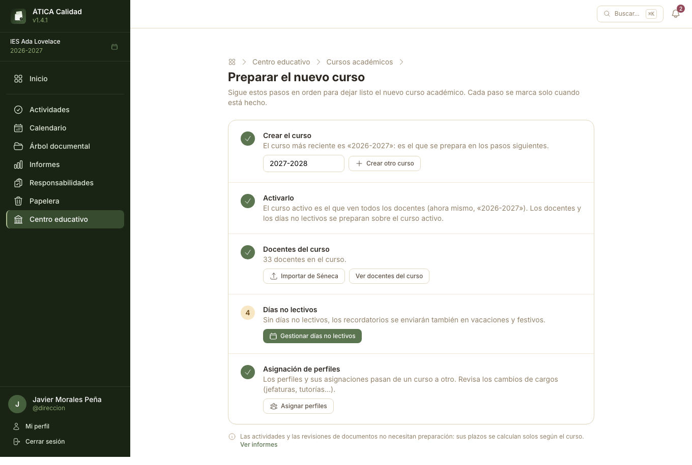

# Preparar el curso académico

Este capítulo es para el equipo directivo y la administración del centro. Antes de que el
profesorado pueda usar la aplicación con normalidad, conviene dejar preparados unos pocos datos
básicos del curso académico.

## Cursos académicos

Cada centro tiene uno o varios cursos académicos (p. ej. «2026-2027»), y siempre hay uno marcado
como **activo**: el que ve por defecto todo el profesorado al entrar. Desde
**Centro educativo → Cursos académicos** puedes crear el curso nuevo, activarlo cuando corresponda
y consultar los anteriores.

## Preparar el nuevo curso {#preparar-el-nuevo-curso}

Al principio de cada curso, lo más cómodo es seguir **Centro educativo → Cursos académicos →
Preparar el nuevo curso**: una lista de pasos, en el orden en que conviene darlos, que se marcan
solos cuando están hechos. Cada paso incluye su propio botón o un enlace a la página donde se hace:

1. **Crear el curso.** El nombre del siguiente ya aparece sugerido: si el último es «2025-2026»,
   propone «2026-2027» (y «2025/26» pasaría a «2026/27»). El curso que se prepara en los pasos
   siguientes es siempre el más reciente.
2. **Activarlo.** Desde ese momento, todo el profesorado trabaja en el curso nuevo. Los anteriores
   siguen disponibles para consultarlos. Los docentes y los días no lectivos se preparan ya sobre el
   curso activo, así que los pasos siguientes esperan a que lo actives.
3. **Docentes del curso.** Con **Copiar docentes** se añaden de un clic todos los docentes de un
   curso anterior; después basta con quitar a quien ya no esté. Si tienes el listado de Séneca,
   también puedes importarlo.
4. **Días no lectivos.** Sin ellos, los recordatorios por correo se envían también en vacaciones y
   festivos.
5. **Asignación de perfiles.** Los perfiles y sus asignaciones pasan de un curso a otro. Este paso
   lista las asignaciones de docentes que ya no están en el curso (una jefatura o una tutoría que
   sigue a nombre de alguien que se fue), para quitarlas o pasarlas a quien le sustituya.

Las actividades y las revisiones de documentos no necesitan preparación: sus plazos se calculan
solos según el curso.

## Docentes del centro

Desde **Centro educativo → Docentes del centro** añades al curso activo el profesorado que va a
trabajar con la aplicación este curso, bien buscando su usuario si ya existe en el sistema (de un
curso anterior o de otro centro), bien registrándolo, o importando el listado completo desde un CSV
exportado de Séneca.

## Días no lectivos

Desde **Centro educativo → Días no lectivos** registras los festivos, puentes y días de libre
disposición del curso académico — se importan también desde el calendario oficial (.ics) o desde un
CSV de Séneca. El calendario los marca automáticamente como no lectivos.

## Perfiles

Desde **Centro educativo → Perfiles** asigna a docentes concretos los perfiles de **responsable de
calidad** y **auditor/a interno/a** del centro. La asignación es permanente por centro: no hace
falta repetirla en cada curso académico.

Estos son los dos únicos perfiles fijos del centro. Si necesitas responsabilidades adicionales y
personalizadas (tutorías, jefaturas de familia profesional, coordinaciones...), se crean aparte,
en [Responsabilidades](06-responsabilidades.md).

## Ajustes del centro

Desde **Centro educativo → Ajustes del centro** se configuran los valores propios del centro, como
el registro de avisos por correo o las plantillas PDF de los informes.
