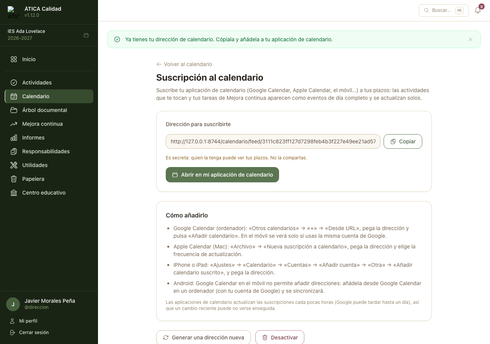

# Calendario

Todo el profesorado tiene acceso a un calendario mensual del centro, con navegación por mes y
detalle de cada día.

## Navegación

El calendario muestra los días lectivos del curso académico visualizado (de lunes a viernes; los
festivos y días no lectivos aparecen marcados). Pulsa sobre cualquier día para ver su detalle:
eventos programados y, si el día no es lectivo, el motivo.

## Eventos

El equipo directivo y la administración del centro pueden crear eventos (p. ej. una reunión o una
fecha de entrega) desde la pestaña **Eventos** del calendario. Cada evento puede ser **general**
(visible para todo el profesorado del centro) o **restringido a perfiles o subperfiles concretos**
de [Responsabilidades](06-responsabilidades.md#perfiles-especificos) (solo lo ven quienes tengan
asignado alguno de los perfiles o subperfiles seleccionados).

## Plazos de actividades

El calendario muestra también las actividades del docente, con enlace directo a cada una. Una
actividad con un rango real (fecha de inicio y de fin distintas) aparece como una banda que cubre
**todos los días** de ese periodo, tanto en la cuadrícula del mes como en el detalle de cada día;
una actividad de fecha única (inicio y fin coinciden) se muestra como una sola marca en esa fecha.
Cada **categoría** de actividades tiene su propio color, así que las actividades de la misma
categoría se reconocen de un vistazo. Ver
[Actividades](08-actividades.md#actividades-en-el-calendario).

## Suscripción al calendario {#suscripcion-al-calendario}

Cada docente puede **suscribir su aplicación de calendario** (Google Calendar, Apple Calendar, el
calendario del móvil…) a sus plazos personales. Desde el calendario, el botón **Suscribirme a mi
calendario** abre una página donde **Activar mi calendario** genera una dirección propia. En el
calendario aparecen, como eventos de día completo:

- las **actividades** que le tocan y aún no ha completado ni tiene en revisión (incluidas las que
  todavía no se han abierto), en la fecha de su plazo, con enlace a la actividad;
- sus **tareas de Mejora continua** que tienen fecha límite.

Es el mismo contenido que «Tus próximos pasos»: lo que se completa o entra en revisión desaparece en
la siguiente actualización. Un calendario es **por centro**.

La página ofrece **Copiar** la dirección y **Abrir en mi aplicación de calendario** (para móviles
y Mac), con las instrucciones para Google Calendar, Apple Calendar, iPhone/iPad y Android. Hay
también una [ficha rápida](https://github.com/reasol-edu/atica-calidad/blob/main/docs/cheatsheets/calendario-movil.md).

!!! warning "La dirección es secreta"
    La aplicación de calendario no inicia sesión: quien conozca la dirección puede ver tus plazos. No
    la compartas. Si crees que otra persona la tiene, pulsa **Generar una dirección nueva** (la
    anterior deja de funcionar y hay que volver a suscribirse) o **Desactivar**.

Las aplicaciones de calendario refrescan las suscripciones cada pocas horas (Google puede tardar
hasta un día), así que un cambio reciente puede tardar en verse.
