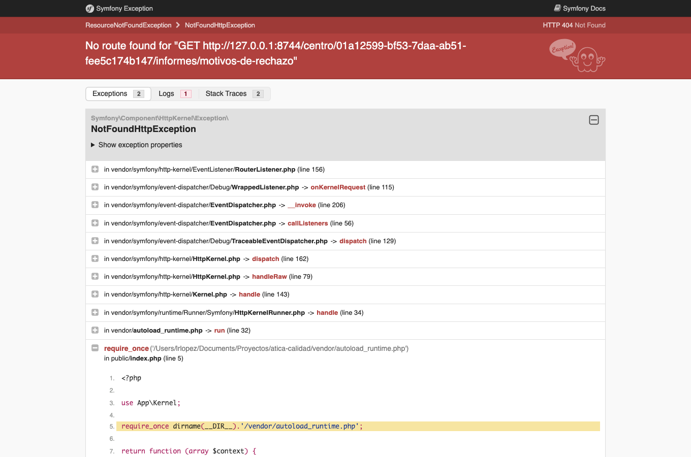

# Administrar el centro educativo

Todas las secciones de administración de un centro concreto se agrupan bajo **Centro educativo**,
visible en el menú lateral para el equipo directivo y la administración del centro. Su
configuración inicial se describe en
[Preparar el curso académico](02-preparar-el-curso-academico.md); este capítulo recoge lo que falta
por documentar del resto del hub.

## Registro de avisos por correo

Desde **Centro educativo → Registro de avisos por correo** se consulta el historial de correos
automáticos enviados por la aplicación (destinatario, evento, asunto y resultado del envío),
filtrable por fecha, evento y resultado. El registro solo se guarda si el ajuste **«Registrar los
avisos por correo»** está activado (ver [Ajustes disponibles](10-administrar-la-plataforma.md#ajustes-disponibles)),
y sus entradas se eliminan automáticamente pasado el número de días configurado en
**«Retención de los registros»**.

De forma análoga, el equipo directivo puede activar o desactivar para su centro el
[registro de actividad](10-administrar-la-plataforma.md#registro-de-actividad) (auditoría de
seguridad) con el ajuste **«Registrar la actividad de los usuarios»** en **Centro educativo →
Ajustes del centro**. El registro en sí solo lo consultan los administradores de la plataforma.

## Motivos de rechazo {#motivos-de-rechazo}

Al rechazar una entrega desde la [cola de revisión](08-actividades.md#cola-de-revision), quien revisa
puede elegir con un clic uno de los motivos predefinidos y completarlo con su propio texto. Desde
**Centro educativo → Motivos de rechazo** cada centro decide cuáles ofrecer: una **lista de texto,
un motivo por línea**. Se ignoran las líneas vacías y repetidas, y cada motivo admite hasta 255
caracteres.

Mientras el centro no guarde una lista propia se usan los **motivos estándar** (formato no válido,
documento incompleto, versión incorrecta, falta la firma, fichero ilegible, no corresponde a la
actividad). Dejar el cuadro vacío o pulsar **Restablecer los estándar** vuelve a ellos. El cambio solo
afecta a los motivos que se ofrecen: los rechazos ya hechos conservan el texto con el que se hicieron.

## Varios centros en un mismo servidor

Un mismo servidor puede alojar varios centros educativos con datos completamente separados. Quien
tiene acceso a más de uno elige con cuál trabajar al entrar, y puede cambiar de centro en cualquier
momento desde el icono junto al nombre del centro, en el menú lateral.
