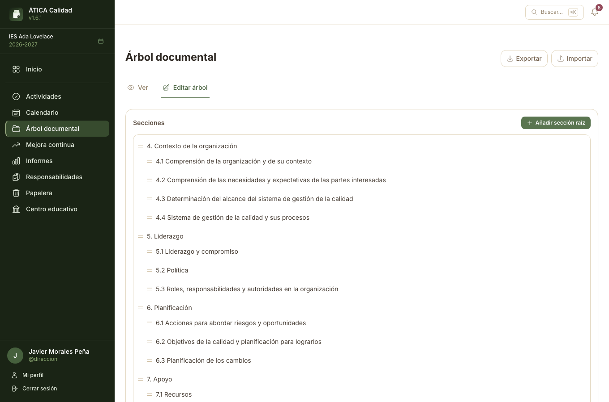
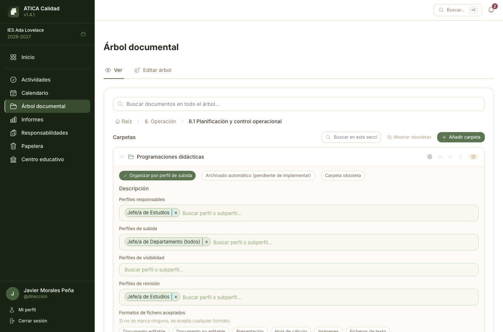
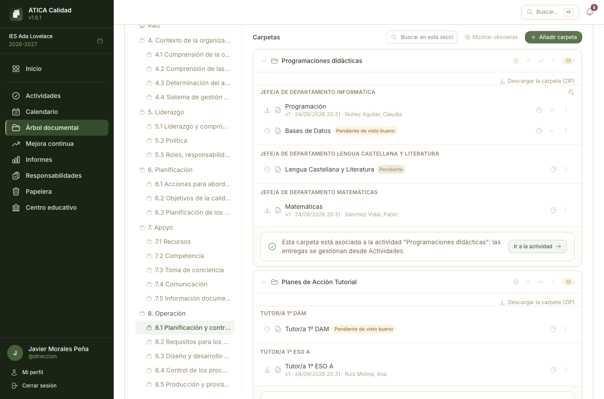
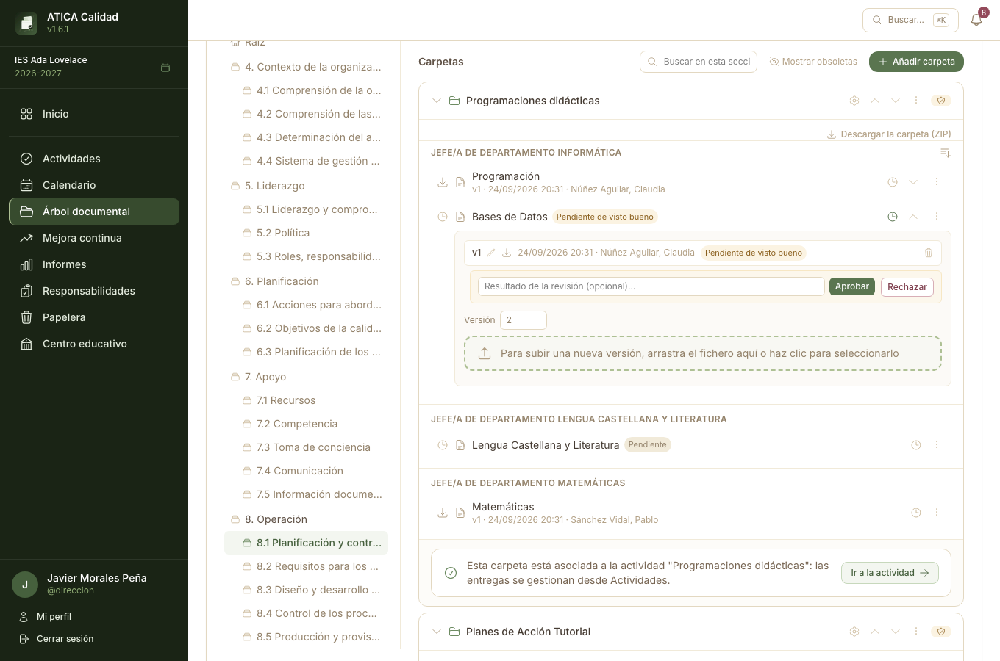
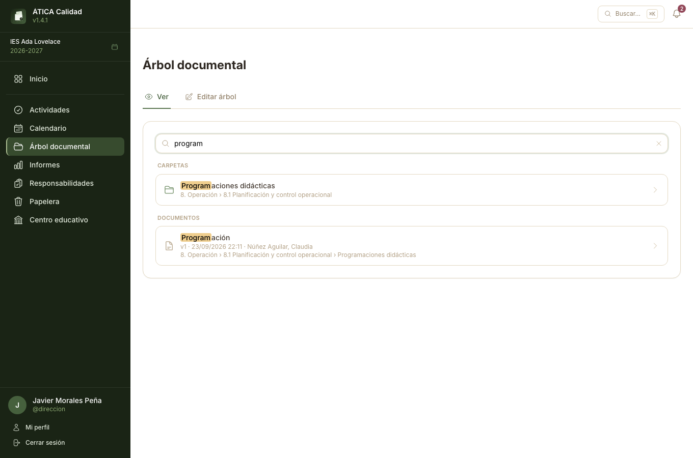

# Árbol documental

El **Árbol documental** es el corazón del sistema de gestión de la calidad: el lugar donde vive la
documentación del centro, organizada en **secciones** (la estructura, como el índice de una
carpeta física) que contienen **carpetas**, y estas a su vez **documentos** con su historial de
**revisiones**. Aparece en el menú lateral para todo el profesorado — lo que cada docente ve dentro
depende de los permisos que se describen en este capítulo.

La sección tiene dos pestañas:

- **Ver** — navegar por el árbol, y también donde se crean y configuran las carpetas y se gestionan
  los documentos. Pensada para el uso diario: responsable de calidad, equipo directivo y cualquier
  docente con algún permiso sobre una carpeta concreta.
- **Editar árbol** — la estructura de secciones en sí (crear, renombrar, mover, eliminar,
  restringir por perfil). Solo la ve quien tiene el mismo permiso que da acceso a
  [Responsabilidades](06-responsabilidades.md#acceso): responsable de calidad, equipo directivo /
  administración del centro, o administración de la plataforma.

!!! info "Quién crea qué"
    Crear y configurar una **sección** requiere ese mismo permiso (pestaña **Editar árbol**).
    Crear y configurar una **carpeta** requiere también ese permiso, pero se hace desde la pestaña
    **Ver**, no desde Editar árbol — al fin y al cabo, una carpeta es contenido de una sección, no
    parte de su estructura. Una vez creada, quien sea **responsable** de esa carpeta concreta (ver
    [Permisos sobre una carpeta](#permisos-sobre-una-carpeta) más abajo) puede gestionar su
    contenido, pero no sus ajustes ni su existencia — eso sigue siendo cosa de responsable de
    calidad/administración.

## Secciones (pestaña «Editar árbol»)

Una sección es un nodo del árbol, con la profundidad que se necesite — igual que las
[listas de Responsabilidades](06-responsabilidades.md#listas), pero pensada para organizar
documentación en vez de nombres. Por ejemplo:

```
Capítulo 1
├── 1.1. Misión
Calidad
├── Documentación general
│   ├── Política de calidad
│   └── Archivo histórico
└── Procesos
```



Desde **Árbol documental → Editar árbol** se añaden secciones raíz o subsecciones, se renombran, se
reordenan (arrastrando, lo que también permite mover una sección a otro padre) y se eliminan
(bloqueado si tiene subsecciones: hay que vaciarlas primero). Cada sección puede además
**restringirse a uno o varios perfiles/subperfiles** de Responsabilidades, con el mismo selector de
migas de pan que en el resto de la aplicación: si no se restringe a ninguno, la ven todos; si se
restringe, solo la ven quienes tengan asignado alguno de esos perfiles o subperfiles.

!!! warning "Las restricciones no se heredan"
    A diferencia de las etiquetas de las listas de Responsabilidades, una restricción de sección
    **no** pasa a sus subsecciones. Si «Calidad» está restringida a un perfil, sus subsecciones
    «Documentación general» y «Procesos» siguen siendo visibles para todo el mundo salvo que se
    restrinjan también, cada una por su cuenta. Lo mismo se aplica a las carpetas: la restricción de
    visibilidad de una carpeta no depende de si su sección está restringida, y viceversa.

### Exportar e importar

**Editar árbol → Exportar** descarga la estructura completa de secciones del centro en un fichero
JSON (nombres, jerarquía y restricciones de perfil, por nombre). **Importar** hace el camino
inverso: **sustituye por completo** el árbol de secciones actual por el del fichero — no se puede
deshacer. Las asociaciones a perfiles/subperfiles se reconstruyen buscándolos por nombre; si alguno
ya no existe en el centro, esa asociación concreta se omite y se avisa al terminar. Útil para
replicar la misma estructura documental entre centros, o como copia de seguridad de la estructura
antes de una reorganización grande.

!!! danger "Importar no toca las carpetas"
    Importar sustituye las **secciones**, no las carpetas ni los documentos que cuelgan de ellas.
    Si el fichero importado no incluye (por nombre y posición) una sección que ya tenía carpetas,
    esas carpetas se eliminan junto con la sección — con todos sus documentos y revisiones. Revisa
    bien el resumen de la importación antes de confirmar en un centro que ya tiene documentación
    subida.

## Carpetas (pestaña «Ver»)

Dentro de cada sección, quien tiene permiso de administración ve un botón **Añadir carpeta**. Cada
carpeta tiene un nombre y varios interruptores/listas independientes que controlan quién puede
hacer qué con ella y qué se puede subir — el desglose de los permisos está en
[Permisos sobre una carpeta](#permisos-sobre-una-carpeta) más abajo. Se abren desde el icono de
ajustes de la carpeta (**⚙ Ajustes de la carpeta**):

- **Organizar por perfil de subida** — si se activa, los documentos de la carpeta se agrupan
  visualmente por el perfil con el que se subieron (ver [Subir un documento](#subir-un-documento)),
  en vez de mostrarse todos juntos.
- **Archivado automático** — interruptor reservado para una función todavía no implementada
  (mover documentos antiguos a un histórico automáticamente). Por ahora no tiene ningún efecto.
- **Descripción** — texto con formato (negrita, listas, enlaces...) que se muestra sobre el
  contenido de la carpeta a todo el que la vea. Útil para dejar instrucciones o contexto sin tener
  que subirlos como un documento más.
- **Carpeta obsoleta** — oculta la carpeta y todo su contenido para el resto del profesorado, sin
  borrar nada. Solo responsable de calidad/administración pueden volver a verla, activando
  **Mostrar obsoletas** en la cabecera de la sección, y solo ellos pueden revertir el estado. Útil
  para retirar documentación superada sin perder su histórico.
- **Perfiles responsables / de subida / de visibilidad / de revisión** — las cuatro listas que
  determinan los permisos sobre el contenido de la carpeta (ver la siguiente sección).
- **Formatos de fichero aceptados** — restringe lo que se puede subir a la carpeta a uno o varios
  de un conjunto fijo: documento editable (Word, ODT, RTF...), documento no editable (PDF),
  presentación, hoja de cálculo, imágenes o ficheros de texto. Sin ninguno marcado, se acepta
  cualquier formato. Se comprueba por la extensión del fichero o por su tipo, así que basta con
  que uno de los dos encaje.



Dentro de una sección, las carpetas se reordenan con las flechas de subir/bajar (o desde el menú
**⋯** en pantallas estrechas) y se renombran o eliminan desde ese mismo menú — eliminar una carpeta
está bloqueado mientras tenga documentos.

### Permisos sobre una carpeta

Cada carpeta tiene cuatro listas independientes de perfiles/subperfiles de
[Responsabilidades](06-responsabilidades.md), cada una con su propio efecto. Una lista vacía se
interpreta de forma distinta según cuál sea:

| Lista | Si está vacía | Si tiene perfiles asignados |
| --- | --- | --- |
| **Responsables** | Nadie (aparte de responsable de calidad/admin) puede gestionar el contenido | Solo quien tenga uno de esos perfiles puede gestionar el contenido |
| **De subida** | Nadie puede subir salvo los responsables | Además de los responsables, quien tenga uno de esos perfiles puede subir documentos nuevos, etiquetados con su propio perfil |
| **De visibilidad** | La carpeta es visible para todo el profesorado | Solo la ven quienes tengan uno de esos perfiles (más responsable de calidad/admin/auditor/a) |
| **De revisión** | Las revisiones subidas se publican directamente, sin pasar por «pendiente» | Cada revisión nueva queda pendiente hasta que alguien con uno de estos perfiles la apruebe o la rechace |

Ser **responsable** de una carpeta da acceso completo a su contenido: subir con cualquier perfil,
renombrar y mover documentos, elegir la revisión activa, editar o eliminar revisiones sueltas, y
aprobar/rechazar. Responsable de calidad y administración del centro son responsables de **todas**
las carpetas, siempre, aunque no aparezcan en ninguna de las listas.

!!! info "Las excepciones: quien sube la última revisión, y su perfil"
    Sin ser responsable de la carpeta, el **docente que subió la revisión activa** de un documento
    conserva dos permisos sobre ese documento concreto: subir una **nueva** revisión, o **eliminar
    el documento entero** (con todo su historial). No puede, en cambio, elegir qué revisión está
    activa, editar o eliminar una revisión suelta, ni ver el historial completo de versiones —
    salvo que además tenga permiso de revisión (para aprobar/rechazar) o sea responsable.

    Estos dos permisos se extienden además a **cualquier docente que tenga el mismo perfil de
    subida con el que se etiquetó el documento** — no hace falta ser quien lo subió en persona,
    basta con compartir el perfil. Por ejemplo, si «Programación didáctica de Matemáticas» se
    subió con el perfil «Jefatura de Departamento de Matemáticas», cualquier docente con ese
    perfil puede sustituirla o eliminarla, no solo quien la subió la primera vez — útil para que
    un cambio de jefatura de departamento no deje huérfanos los documentos del anterior. Se aplica
    igual dentro de una [actividad](08-actividades.md) de ámbito **por perfil**, ya que su entrega
    es igualmente compartida por todo el perfil.

    La única excepción a esta ampliación es una actividad de ámbito **individual**: ahí varios
    docentes pueden compartir perfil (p. ej. varios tutores con el perfil «Tutor/a») sin compartir
    entrega — cada uno tiene la suya — así que compartir perfil deja de bastar; solo cuenta quien
    subió la entrega en persona (ver
    [Entregas y revisión](08-actividades.md#entregas-y-revision)).

    Ninguno de los dos casos depende de las listas de la carpeta ni requiere ser su responsable.

## Documentos y revisiones



### Subir un documento

Con permiso de subida en una carpeta (responsable o perfil de subida), aparece una zona para
arrastrar ficheros o hacer clic para seleccionarlos (tamaño máximo: 20 MB por fichero; el tipo es
libre salvo que la carpeta tenga configurados **formatos de fichero aceptados**, en cuyo caso se
rechaza cualquier fichero que no encaje en ninguno). Tras soltarlos, se confirma un nombre y,
si la carpeta tiene **perfiles de subida** configurados, con qué perfil se etiqueta cada uno: quien
es responsable de la carpeta puede elegir libremente entre todos ellos; quien solo tiene permiso de
subida solo puede etiquetar con su propio perfil o subperfil.

Cada documento subido nace con su primera revisión, **versión 1**. Si la carpeta tiene perfiles de
revisión configurados, esa primera revisión queda **pendiente de visto bueno** hasta que se apruebe
o se rechace (ver [Revisar una versión pendiente](#revisar-una-version-pendiente)); si no, se
activa directamente.

### Subir una nueva revisión

Desde el documento, quien puede gestionarlo (responsable de la carpeta, o el docente que subió la
revisión activa) arrastra un nuevo fichero al recuadro **«Para subir una nueva versión, arrastra el
fichero aquí o haz clic para seleccionarlo»**, dentro del panel de versiones (icono de reloj). El
número de versión se incrementa automáticamente; no puede coincidir con el de otra revisión ya
existente del mismo documento — la aplicación lo impide con un aviso claro.



### Revisar una versión pendiente

Quien tiene permiso de revisión sobre la carpeta (responsable, o alguno de los perfiles de
revisión) ve, en el panel de versiones, las revisiones **pendientes de visto bueno** con botones
**Aprobar** y **Rechazar** (con un resultado opcional en texto libre). Aprobar una revisión la
convierte automáticamente en la **revisión activa** del documento — a menos que, después, alguien
con permiso de gestión la cambie manualmente por otra ya aprobada. Una revisión rechazada no puede
elegirse como activa, pero queda en el historial.

### Revisión activa, historial y descarga

El icono de descarga de cada documento baja siempre su **revisión activa**; si todavía no tiene
ninguna (primera versión aún pendiente), el documento se muestra como «Pendiente» en su lugar. El
fichero descargado usa el **nombre del documento**, no el del fichero original que se subió —
conservando su extensión.

El enlace **«Descargar la carpeta (ZIP)»**, encima de la lista de documentos, empaqueta de una vez
la revisión activa de todos los documentos de la carpeta (los que aún no tienen revisión activa
quedan fuera). Si la carpeta está **organizada por perfil de subida**, dentro del ZIP cada perfil
es una subcarpeta con su nombre —los caracteres que no valen en un nombre de fichero se
sustituyen por `_`—, y los documentos sin perfil van en la raíz del archivo.

Quien es responsable de la carpeta (o tiene permiso de revisión, para poder aprobar con
conocimiento del histórico) puede abrir el **historial completo de revisiones**: fecha, quién la
subió, su estado (activa / pendiente / aprobada / rechazada) y acciones para elegir cuál es la
activa, editar los metadatos de una revisión o eliminarla individualmente. El resto —incluido quien
solo tiene el permiso de excepción por haber subido la última versión— ve un aviso indicándole que
solo el responsable puede consultar el historial.

### Renombrar, mover y eliminar documentos

Renombrar un documento, moverlo a otra carpeta de la misma sección (con un selector, no
arrastrando) y reordenar manualmente el contenido de una carpeta requiere ser responsable de esa
carpeta. **Eliminar el documento completo**, con todo su historial de revisiones, sí está permitido
también a quien subió su revisión activa, aunque no sea responsable (ver
[la excepción de arriba](#permisos-sobre-una-carpeta)).

## Buscar en el árbol documental



Hay tres formas de buscar, cada una para un caso distinto:

- **Búsqueda global** (encima del árbol, en la pestaña Ver) — busca en **todo** el árbol del
  centro: secciones, carpetas y documentos por nombre, y además el perfil de subida y el nombre de
  quien subió la revisión activa de cada documento. A partir de dos letras, los resultados
  sustituyen a la miga de pan, agrupados en **Secciones**, **Carpetas** y **Documentos**; tocar uno
  te lleva directamente a esa sección/carpeta. Al tocar un documento no se abre su panel de
  versiones: el documento se resalta con un parpadeo suave para que lo localices de un vistazo entre
  el resto del contenido de la carpeta.
- **Búsqueda local de la sección** (junto a los botones de mostrar obsoletas y añadir carpeta) —
  filtra el contenido ya cargado de la sección actual, con las mismas coincidencias que la global
  (nombre de carpeta, de documento, perfil y docente), además del **subperfil** exacto con el que se
  subió. Al escribir, todas las carpetas de la sección se despliegan automáticamente para que no se
  pierda ningún resultado, y el texto que coincide se resalta en amarillo. Si la coincidencia es el
  nombre de la propia carpeta, se muestran todos sus documentos, no solo los que coinciden por su
  propio nombre.
- **Paleta de comandos** (**⌘K** / **Ctrl+K**, desde cualquier pantalla) — la misma búsqueda global,
  accesible sin estar ya en el árbol documental. Ver
  [Buscar con la paleta de comandos](../cheatsheets/busqueda-rapida.md).

## Permisos, de un vistazo

| Puede... | Docente sin perfil sobre la carpeta | Docente con perfil de subida | Docente que subió la última revisión, o comparte su perfil de subida² | Perfil responsable de la carpeta / perfil de revisión (aprobar-rechazar) | Responsable de calidad / equipo directivo / admin. |
| --- | :-: | :-: | :-: | :-: | :-: |
| Ver la sección/carpeta (si no está restringida) | ✅ | ✅ | ✅ | ✅ | ✅ |
| Ver la sección/carpeta (si está restringida a otros perfiles) | — | — | — | según corresponda | ✅ |
| Descargar la revisión activa | ✅¹ | ✅¹ | ✅¹ | ✅ | ✅ |
| Descargar la carpeta entera en ZIP | ✅¹ | ✅¹ | ✅¹ | ✅ | ✅ |
| Subir un documento nuevo | — | ✅ (con su propio perfil) | — | ✅ (con cualquier perfil) | ✅ |
| Subir una nueva revisión de un documento existente | — | — | ✅ | ✅ | ✅ |
| Eliminar el documento completo | — | — | ✅ | ✅ | ✅ |
| Ver el historial completo de revisiones | — | — | — | ✅ | ✅ |
| Elegir la revisión activa / editar o eliminar una revisión suelta | — | — | — | ✅ (responsable) | ✅ |
| Aprobar o rechazar una revisión pendiente | — | — | — | ✅ (con perfil de revisión) | ✅ |
| Renombrar, mover o reordenar documentos | — | — | — | ✅ (responsable) | ✅ |
| Crear/configurar carpetas, restringir secciones | — | — | — | — | ✅ |

¹ Siempre que la sección/carpeta le sea visible.

² La ampliación a «quien comparte el perfil» no aplica en una actividad de ámbito individual — ver
[Permisos sobre una carpeta](#permisos-sobre-una-carpeta) más arriba.

Volver a [Permisos de un vistazo](10-permisos-de-un-vistazo.md) para el resto de la aplicación.
