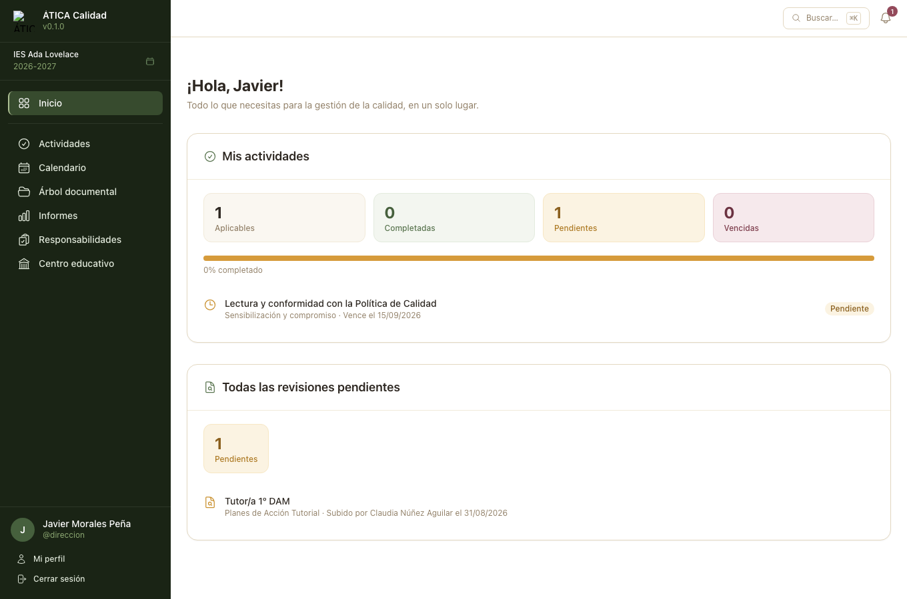
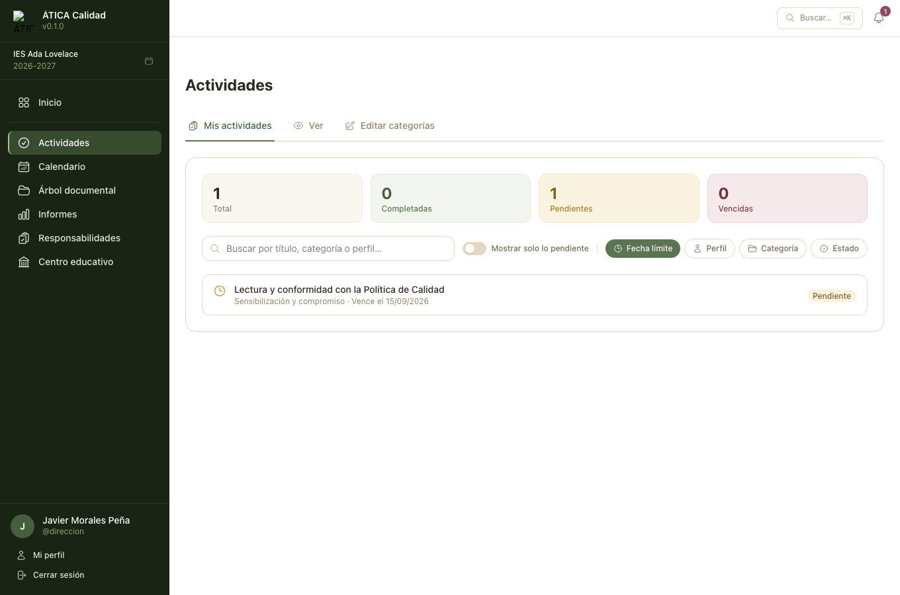
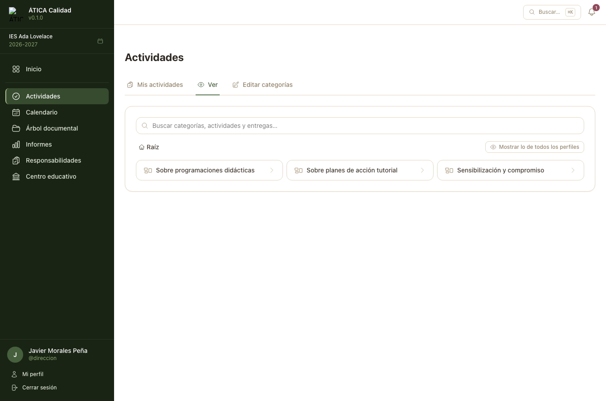
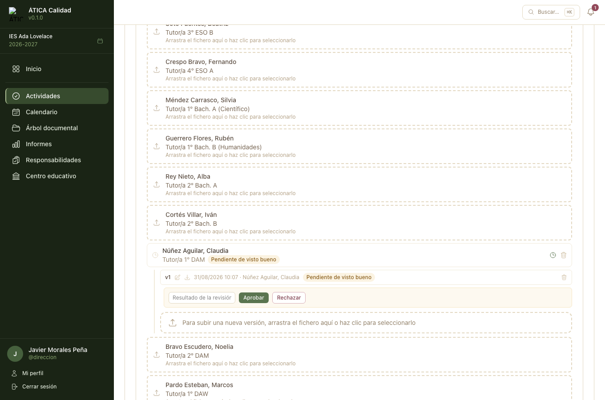
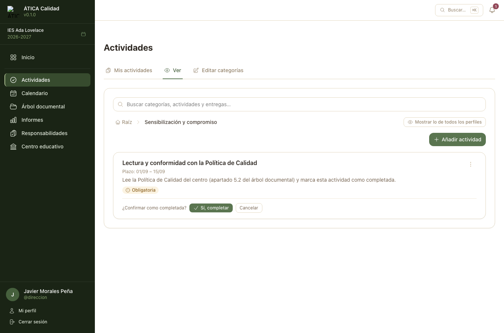
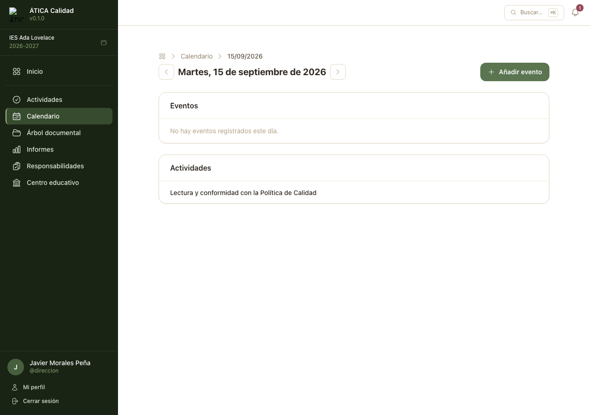

# Actividades

**Actividades** organiza los plazos y tareas periódicas del sistema de gestión de la calidad —
programaciones didácticas, planes de acción tutorial, lecturas obligatorias, cualquier cosa que
haya que completar o entregar antes de una fecha— agrupadas en **categorías** propias del centro.
Aparece en el menú lateral para todo el profesorado; lo que cada docente ve y puede hacer depende
de sus perfiles de [Responsabilidades](06-responsabilidades.md), igual que en el
[Árbol documental](07-arbol-documental.md).

Una actividad puede llevar, o no, una **carpeta del árbol documental** vinculada:

- **Con carpeta** — la entrega consiste en subir un documento a esa carpeta. Los permisos de la
  carpeta (perfiles de subida y de revisión, ver
  [Permisos sobre una carpeta](07-arbol-documental.md#permisos-sobre-una-carpeta)) gobiernan
  también quién entrega y quién revisa la actividad.
- **Sin carpeta** — es un simple recordatorio con fecha límite, que se completa a mano con un
  botón (ver [Completar una actividad manual](#completar-una-actividad-manual)).

La sección tiene tres pestañas: **Mis actividades** (vista personal, la que se abre por defecto),
**Ver** (navegación por categorías, con lo que le corresponde a cada uno y, opcionalmente, lo de
todo el mundo) y **Editar categorías**, reservada a responsable de calidad, equipo
directivo/admin. del centro y admin. de la plataforma — el mismo papel que edita el árbol
documental.

## Panel principal

Al entrar, el **Inicio** de la aplicación resume lo que hay pendiente:

- **Mis actividades** — total, completadas, pendientes y vencidas del docente, con una barra de
  progreso y la lista de las que quedan por hacer (enlaza a
  [Mis actividades](#mis-actividades) para el detalle completo).
- **Revisiones pendientes** — documentos, de cualquier carpeta, que el docente debe revisar
  personalmente (ver [Entregas y revisión](#entregas-y-revision)).
- **Todas las revisiones pendientes** — solo para responsable de calidad y administración: todas
  las revisiones pendientes del centro, no solo las propias, para tener una vista de conjunto sin
  depender de a quién le toque revisar cada carpeta. El resto del profesorado no ve esta tarjeta.

## Mis actividades

Lista plana de todas las actividades que le corresponden al docente, en cualquier categoría, con
buscador, un interruptor **Mostrar solo lo pendiente** y filtros por fecha límite, perfil,
categoría y estado. Es la vista pensada para el día a día: «¿qué me queda por hacer?», sin tener
que navegar por la estructura de categorías.

## Ver (categorías)

Navegación por migas de pan, igual que en el árbol documental: categorías con subcategorías y,
dentro de cada una, sus actividades. Por defecto solo se ven las actividades de los perfiles que
tiene el docente; **Mostrar lo de todos los perfiles** añade también las demás, atenuadas, para
quien necesite una vista completa sin tener que asumir esos perfiles.

## Editar categorías

Reservada a responsable de calidad, equipo directivo/admin. del centro y admin. de la plataforma —
mismo papel que [Editar árbol](07-arbol-documental.md#secciones-pestana-editar-arbol). Las
categorías son nodos con la profundidad que se necesite (crear, renombrar, reordenar, eliminar),
igual que las secciones del árbol documental; dentro de cada una se crean y editan las actividades.

### Campos de una actividad

| Campo | Significado |
| --- | --- |
| Título / Descripción | Texto libre. |
| Fecha de inicio / Fecha de fin | Solo **día y mes** (sin año): la actividad se repite automáticamente cada curso académico en esas fechas. |
| Carpeta | Opcional. Si se elige una, la actividad pasa a tener entregas (ver [Entregas y revisión](#entregas-y-revision)); si se deja vacía, se completa a mano. |
| Lista para nombrar entregas | Opcional. Un elemento de [Listas](06-responsabilidades.md#listas) (p. ej. «Materia») cuyas hojas nombran cada entrega esperada. |
| Documentos relacionados | Documentos del árbol documental enlazados como lectura de apoyo, independientes de la carpeta de entregas. |
| Obligatoria / Opcional | Solo informativo: se muestra como etiqueta, no cambia ningún permiso. |
| Ámbito de entrega | **Por perfil** (una entrega compartida por todo el que tenga el perfil/subperfil) o **Individual** (cada docente con ese perfil entrega la suya). |
| Completado automático | Solo si hay carpeta: la actividad se da por completada en cuanto el documento esperado está aprobado, sin botón de completar manual. |

## Entregas y revisión {#entregas-y-revision}

Al abrir una actividad con carpeta aparecen **Mis entregas** (una fila por cada entrega que le
corresponde al docente, con zona de arrastrar-y-soltar) y, para quien gestiona o revisa la carpeta,
**Todas las entregas** (colapsada por defecto, con las de todo el mundo). El icono de reloj de cada
fila abre el mismo panel de versiones que en el árbol documental, con **Aprobar**/**Rechazar** para
quien tenga permiso de revisión — ver
[Revisar una versión pendiente](07-arbol-documental.md#revisar-una-version-pendiente), que se
aplica aquí sin cambios: una entrega **es** un documento de esa carpeta.

## Completar una actividad manual {#completar-una-actividad-manual}

Una actividad sin carpeta se completa con el botón **Marcar como completada**, que pide
confirmación antes de darla por hecha (para evitar marcarla sin querer). Una vez completada, un
botón **Deshacer** la revierte sin pedir confirmación —deshacer no tiene el mismo riesgo que
completar por error—. Si el ámbito es **por perfil**, hay un botón de completar independiente por
cada perfil/subperfil que tenga el docente.

## Actividades en el calendario

El [calendario](03-calendario.md) muestra, en el detalle de cada día, las actividades cuyo plazo
vence esa fecha —las propias del docente, con un enlace directo a la actividad—.

## Avisos

La [campana de notificaciones](09-administrar-la-plataforma.md#ajustes-disponibles), en la
cabecera, avisa de actividades pendientes/vencidas y de revisiones pendientes personales (nunca de
«Todas las revisiones pendientes», que solo se muestra en el panel principal). La frecuencia de los
avisos por correo —al instante o en un resumen diario— se configura en
**Ajustes → Avisos por correo**, a nivel global, de centro o personal — ver
[Ajustes disponibles](09-administrar-la-plataforma.md#ajustes-disponibles).

## Permisos, de un vistazo

| Puede... | Docente sin el perfil de la actividad | Docente con el perfil de la actividad | Perfil responsable/de revisión de la carpeta vinculada | Responsable de calidad / equipo directivo / admin. |
| --- | :-: | :-: | :-: | :-: |
| Ver la actividad en «Ver» (atenuada, con «Mostrar lo de todos los perfiles») | ✅ | ✅ | ✅ | ✅ |
| Verla en «Mis actividades», el panel principal y el calendario | — | ✅ | según corresponda | ✅ |
| Entregar (con carpeta) / marcar como completada (sin carpeta) | — | ✅ | ✅ | ✅ |
| Deshacer una compleción manual | — | ✅ (la propia) | ✅ | ✅ |
| Aprobar o rechazar una entrega pendiente | — | — | ✅ (con perfil de revisión) | ✅ |
| Crear/editar categorías y actividades | — | — | — | ✅ |

Volver a [Permisos de un vistazo](10-permisos-de-un-vistazo.md) para el resto de la aplicación.
