# Mejora continua

**Mejora continua** es donde el centro registra lo que no funciona como debería y sigue qué se hace
para resolverlo: las **incidencias** que comunica cualquier docente, las **no conformidades** y sus
**acciones** (reparadoras, correctivas, preventivas y de mejora), hasta comprobar que han sido
eficaces, el **plan de mejora** de cada curso, los **indicadores** con los que el centro mide cómo
van sus procesos, la **auditoría interna** y la **revisión por la dirección**. Aparece en el menú
lateral para todo el profesorado.

La sección usa el lenguaje del centro, no el de la norma: nadie necesita saber qué es una «no
conformidad» para comunicar un problema. Los términos de la ISO 9001 aparecen solo como ayuda al
clasificar.

## Quién hace qué

| Papel | Qué hace |
| --- | --- |
| **Cualquier docente** | Comunica incidencias y sigue las que ha comunicado. Si se le asigna una acción, la hace y adjunta la evidencia. Si es responsable de un indicador, registra sus valores. |
| **Responsable del análisis** | Analiza las causas de una no conformidad y propone las acciones correctivas. |
| **Responsable de calidad** y **equipo directivo / admin. del centro** | Clasifican lo que llega, asignan el análisis, verifican la eficacia y cierran. Preparan el plan de mejora, definen los indicadores y deciden qué se hace cuando uno queda fuera de meta. Programan las auditorías (el equipo directivo aprueba el programa). Preparan la revisión por la dirección y anotan sus decisiones (el equipo directivo la cierra). Ven todo. |
| **Auditor/a interno/a** | Consulta todas las fichas, el plan de mejora, los indicadores y sus informes, sin modificarlos. Prepara y realiza las auditorías de cuyo equipo forma parte. |
| **Equipo auditor** | Cualquier docente al que se le asigne una auditoría: la prepara, la realiza y emite su informe. |

Cada docente ve, además de lo que ha comunicado, las fichas en las que tiene algo que hacer: las que
analiza y las que tienen una acción a su nombre o a nombre de uno de sus perfiles.

## Comunicar una incidencia

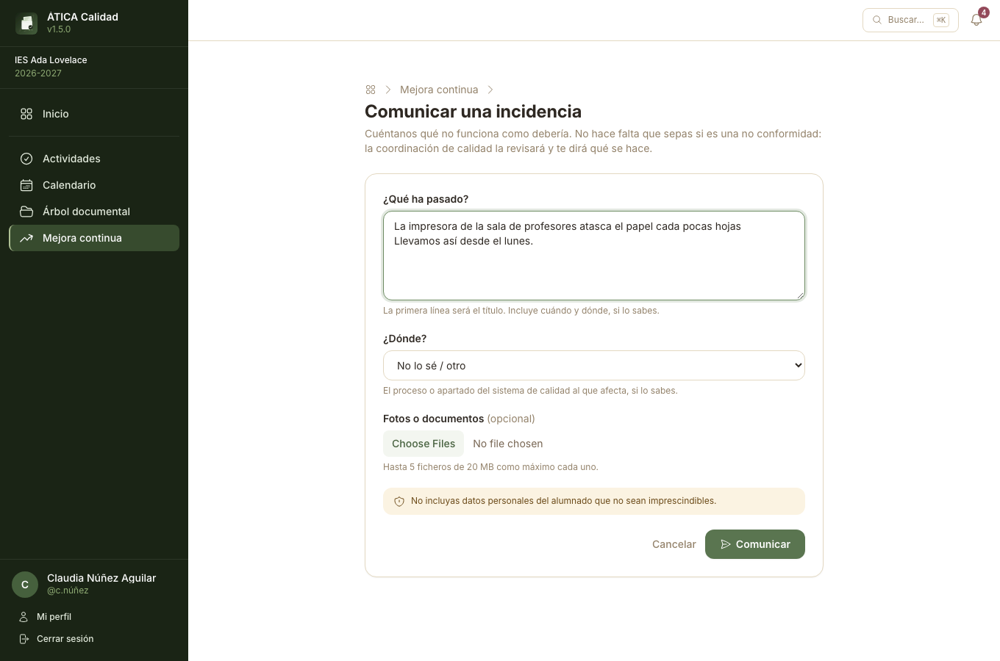

El botón **Comunicar incidencia** está en la portada de Mejora continua y en la paleta de comandos
(**⌘K** / **Ctrl+K**, «Comunicar incidencia»). El formulario pide lo mínimo:

- **¿Qué ha pasado?** — la primera línea se convierte en el título de la ficha; conviene incluir
  cuándo y dónde.
- **¿Dónde?** — el proceso o apartado del [árbol documental](07-arbol-documental.md) al que afecta,
  si se sabe. Si no, «No lo sé / otro».
- **Fotos o documentos** (opcional) — hasta 5 ficheros de 20 MB como máximo cada uno.

Al enviarla, la ficha queda **Comunicada** y la coordinación de calidad recibe un aviso. Quien la
comunicó recibe otro cuando se descarta o se resuelve.

!!! warning "Datos del alumnado"
    No incluyas datos personales del alumnado que no sean imprescindibles para entender el problema.

## La portada

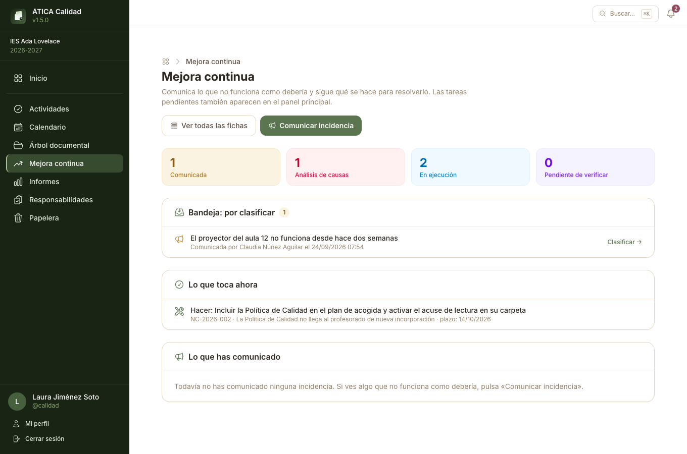

La portada reúne, en este orden:

- **Lo que toca ahora** — las tareas de Mejora continua pendientes para quien la abre (clasificar,
  analizar causas, hacer una acción de una ficha o del plan de mejora, verificar la eficacia), las
  vencidas primero. Ver [Dónde aparece lo que te toca](#donde-aparece-lo-que-te-toca).
- **Bandeja: por clasificar** — solo para quien gestiona: lo comunicado que aún no se ha revisado.
- **Recuentos por estado** — para quien ve todas las fichas; cada uno abre el listado filtrado.
- **Lo que has comunicado** — las incidencias propias y en qué punto están.

Quien ve todas las fichas tiene además los botones **Ver todas las fichas**, **Plan de mejora**,
**Indicadores**, **Auditorías** y **Revisión por la dirección**.

## Dónde aparece lo que te toca {#donde-aparece-lo-que-te-toca}

Nadie tiene que entrar en Mejora continua para enterarse de que tiene algo que hacer. Cada tarea
—clasificar, analizar causas, hacer una acción, verificar la eficacia, registrar el valor de un
indicador, decidir qué se hace con uno fuera de meta, preparar y realizar una auditoría o aprobar el
programa de auditorías— aparece, con el mismo color
que las actividades (ámbar si vence en los próximos 7 días, rojo si ya ha vencido):

- en **Tus próximos pasos** del panel principal, bajo «Mejora continua»;

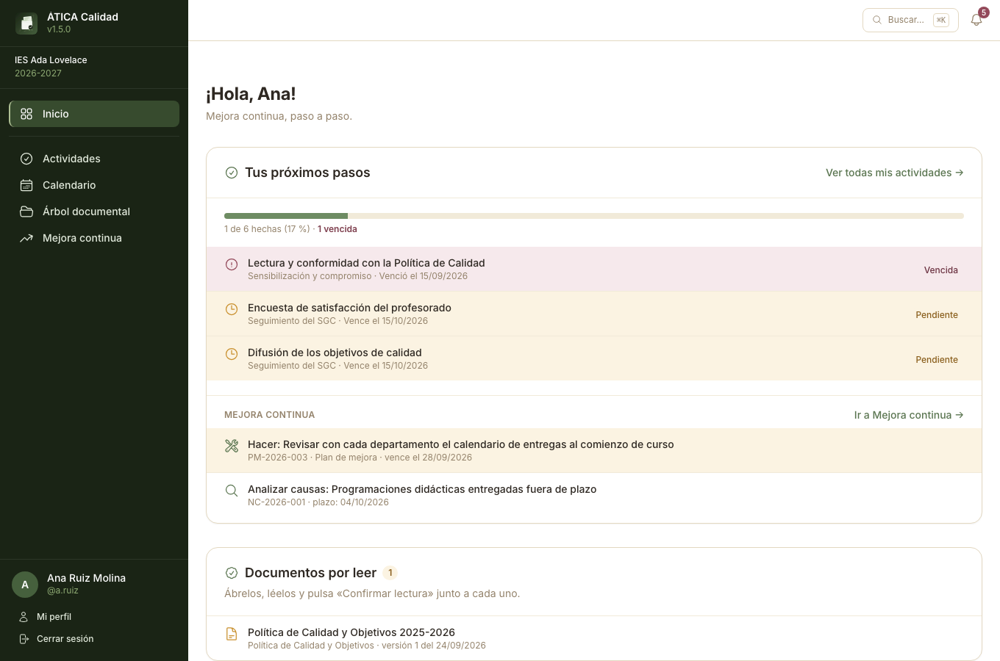

- en la **campana** de la cabecera, en su propio apartado;

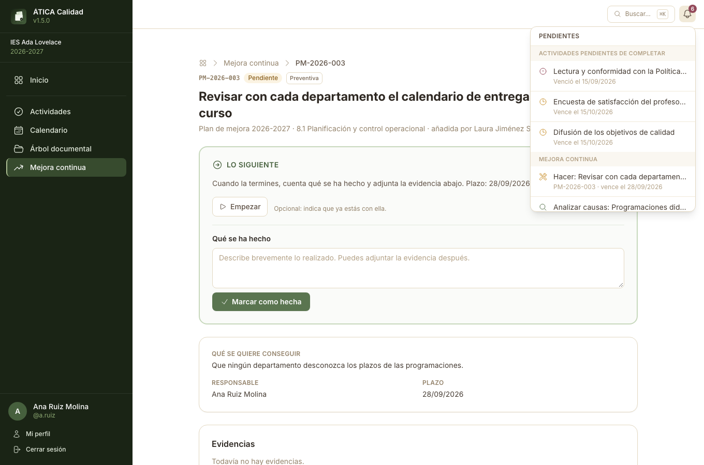

- en el **calendario**, el día en que vence (en violeta, o en rojo si se ha pasado); las acciones ya
  hechas siguen apareciendo, tachadas, como las actividades completadas. Al abrir el día, un
  apartado **Mejora continua** las enumera con un enlace a cada una;

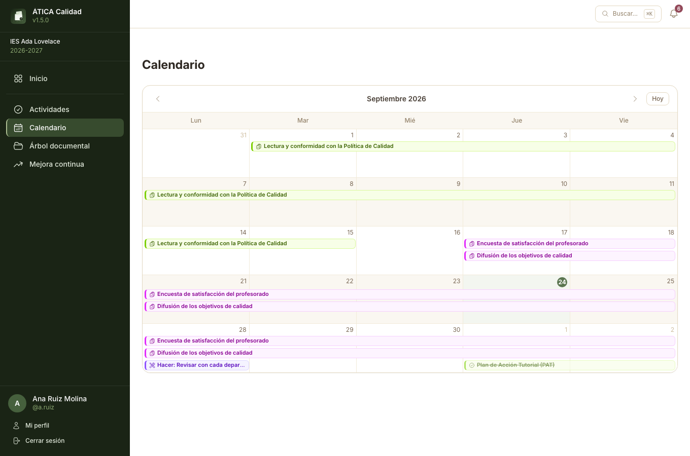

- en el **recordatorio diario por correo** de actividades pendientes: las tareas que han vencido o
  vencen dentro de los días de preaviso se añaden al final. Quien solo tiene tareas de Mejora
  continua lo recibe igualmente, con el asunto «Tareas pendientes de Mejora continua».

## El ciclo de una ficha

Una **no conformidad** recorre todos los pasos: *Comunicada → Análisis de causas → En ejecución →
Pendiente de verificar → Cerrada*; si la verificación concluye que las acciones no han sido
eficaces, vuelve al análisis de causas. Una **observación** o una **oportunidad de mejora** se salta
el análisis y la verificación: *Comunicada → En ejecución → Cerrada*. Cualquier incidencia puede
**descartarse** al revisarla.

| Estado | Qué significa | A quién le toca |
| --- | --- | --- |
| **Comunicada** | Pendiente de revisar. | Coordinación de calidad |
| **Análisis de causas** | Solo no conformidades: buscar la causa raíz y proponer acciones correctivas. | Responsable del análisis |
| **En ejecución** | Hay acciones en marcha. | Responsable de cada acción |
| **Pendiente de verificar** | Solo no conformidades: todas las acciones están hechas; falta comprobar si han funcionado. | Coordinación de calidad |
| **Cerrada** | Resuelta. | — |
| **Descartada** | No requiere actuaciones del sistema de calidad (el motivo queda escrito). | — |

Cada ficha muestra arriba un recuadro **Lo siguiente** que dice qué falta y quién tiene que hacerlo.
Si un paso no se puede dar todavía, el botón aparece desactivado con el motivo al lado (por ejemplo,
«Falta escribir la causa raíz»).

### Clasificar

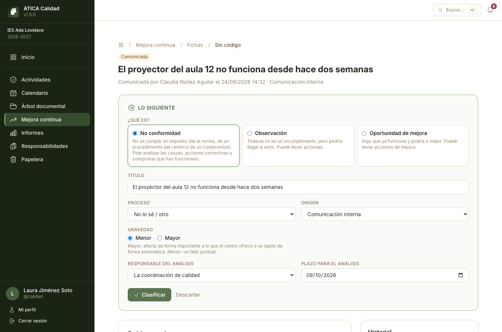

Quien gestiona abre la incidencia desde la bandeja y decide **qué es**:

- **No conformidad** — no se cumple un requisito (de la norma, de un procedimiento del centro o de
  un compromiso). Recibe un código `NC-AAAA-NNN`, una **gravedad** (*Menor*: un fallo puntual;
  *Mayor*: afecta de forma importante a lo que el centro ofrece o se repite de forma sistemática),
  una persona **responsable del análisis** (por defecto, la propia coordinación de calidad) y un
  **plazo** para el análisis. La persona elegida recibe un aviso.
- **Observación** (`OB-AAAA-NNN`) — todavía no es un incumplimiento, pero podría llegar a serlo.
- **Oportunidad de mejora** (`OM-AAAA-NNN`) — algo que ya funciona y podría ir mejor.

Al clasificar se puede corregir el título, y se indican el **proceso** y el **origen** (comunicación
interna, auditoría interna o externa, queja o reclamación, indicador fuera de meta o revisión por la
dirección). Las observaciones y oportunidades de mejora pasan directamente a **En ejecución**.

Si no requiere actuaciones del sistema de calidad (no depende del centro, ya está resuelta…), se
**descarta** con un motivo, que se comunica por correo a quien la envió.

### Analizar las causas

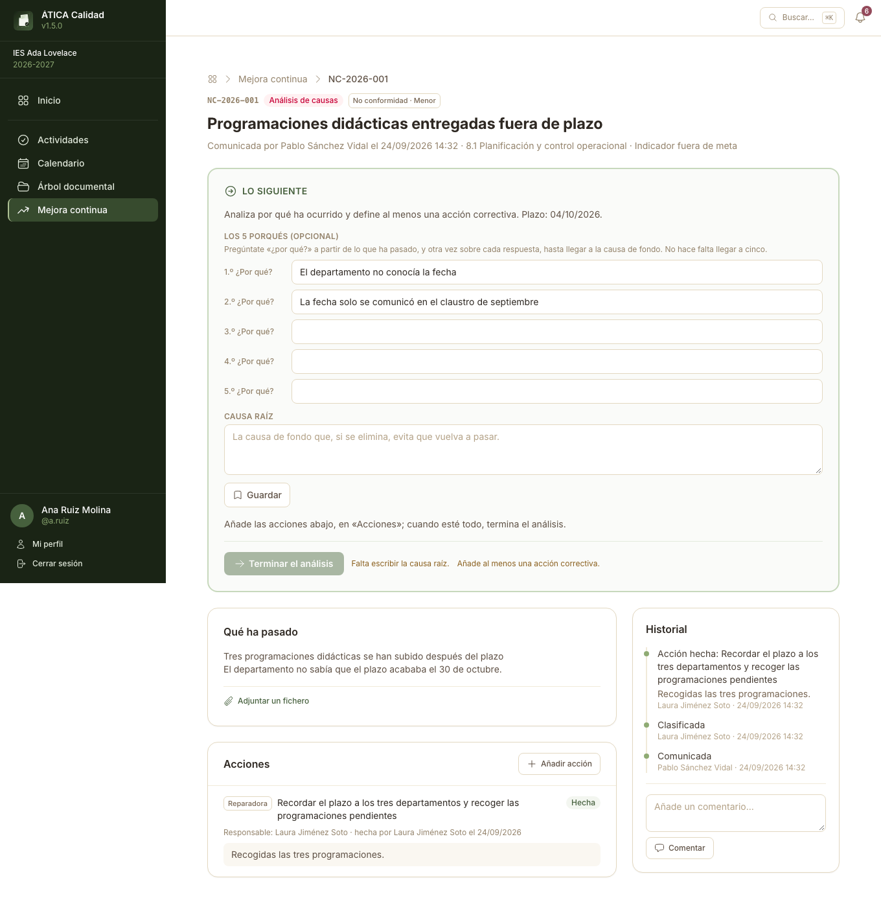

La persona responsable del análisis ve la tarea en su panel principal y en la portada. En la ficha:

1. **Los 5 porqués** (opcional) — preguntarse «¿por qué?» a partir de lo que ha pasado, y otra vez
   sobre cada respuesta, hasta llegar a la causa de fondo. No hace falta llegar a cinco.
2. **Causa raíz** — la causa de fondo que, si se elimina, evita que vuelva a pasar. Obligatoria.
3. **Acciones** — al menos una **correctiva** (ver [Acciones](#acciones)).

**Guardar** conserva el borrador; **Terminar el análisis** pasa la ficha a *En ejecución* y avisa a
los responsables de las acciones.

### Acciones

Cada acción tiene un **tipo**, una descripción, una persona **responsable** y un **plazo**:

| Tipo | Para qué |
| --- | --- |
| **Reparadora** | Arregla el efecto inmediato (la «corrección» de la norma). Suele registrarse ya hecha. |
| **Correctiva** | Elimina la causa para que no vuelva a ocurrir. |
| **Preventiva** | Evita un problema que todavía no ha ocurrido (un riesgo). |
| **De mejora** | Mejora algo que ya funciona. |

La responsable puede ser una persona concreta o un **perfil** de
[Responsabilidades](06-responsabilidades.md) (cualquiera que lo tenga puede hacerla). La casilla
**Ya está hecha** registra una acción terminada, con lo que se hizo, sin pasar por pendiente.

Las añade quien analiza, durante el análisis, y quien gestiona, mientras la ficha está en ejecución.
Quien es responsable de una acción la **empieza**, la **marca como hecha** contando qué se ha hecho
y adjunta la **evidencia** (fotos, actas, documentos…) con «Adjuntar evidencia».

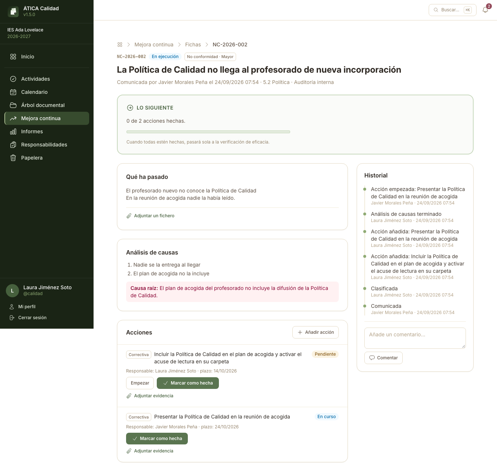

### Verificar la eficacia y cerrar

Cuando todas las acciones de una **no conformidad** están hechas, la ficha pasa sola a **Pendiente
de verificar**, con una fecha propuesta para comprobarlo (30 días después, ajustable en
[Ajustes](#ajustes)); se puede verificar antes. Quien gestiona escribe cómo lo ha comprobado y
elige:

- **Ha sido eficaz** — la ficha se cierra y se avisa a quien la comunicó.
- **No ha sido eficaz** — vuelve a *Análisis de causas*, con lo hecho en el historial. Para
  terminar el nuevo análisis hace falta al menos **una acción correctiva nueva**.

Las **observaciones** y **oportunidades de mejora** no se verifican: quien gestiona las **cierra**
cuando todas sus acciones están hechas.

### Historial, comentarios y adjuntos

Cada ficha lleva un **historial** con quién hizo cada paso y cuándo; cualquiera que ve la ficha
puede añadir un **comentario** o **adjuntar un fichero** mientras esté abierta. Los ficheros se
guardan con el mismo almacén deduplicado que el árbol documental.

## El listado de fichas

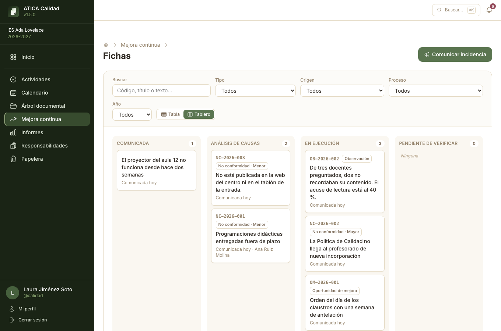

**Ver todas las fichas**, para quien ve todas, abre el listado con buscador (código, título o
texto) y filtros por tipo, origen, proceso, año y estado. Se puede ver como **Tabla** o como
**Tablero**, con una columna por estado. Los filtros quedan en la dirección de la página, así que
un listado filtrado se puede guardar o compartir como enlace.

El registro completo se descarga en PDF o Excel desde [Informes → No
conformidades](04-informes.md#no-conformidades).

## Plan de mejora {#plan-de-mejora}

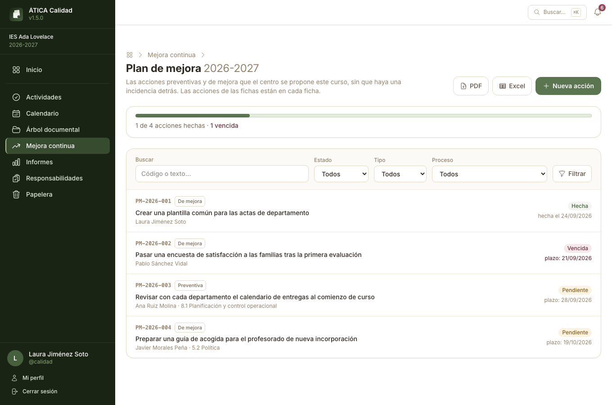

El **plan de mejora** reúne las acciones **preventivas** y **de mejora** que el centro se propone
cada curso sin que haya una incidencia detrás: preparar una guía de acogida, pasar una encuesta a las
familias, revisar un calendario de entregas... (las acciones de las fichas están en cada ficha). Se
abre con **Plan de mejora** desde la portada, y lo ven quienes ven todas las fichas.

Arriba, el avance del curso («1 de 4 acciones hechas · 1 vencida»; «vencida» filtra las que se han
pasado de plazo). Debajo, las acciones por plazo, con buscador y filtros por estado, tipo y proceso,
y los botones para descargarlo en **PDF** o **Excel** (el mismo informe que
[Informes → Plan de mejora](04-informes.md#plan-de-mejora)). Muestra el curso seleccionado en el menú
lateral, así que se pueden consultar los planes de cursos anteriores.

### Añadir una acción

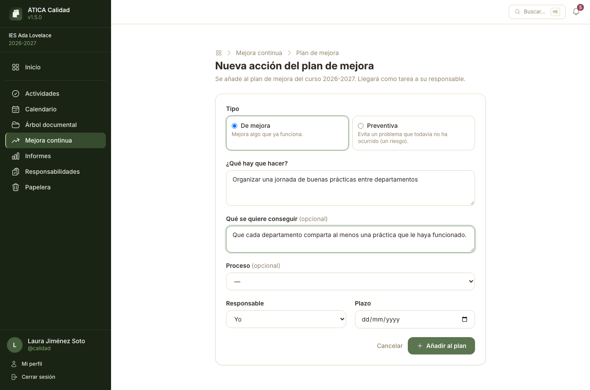

Quien gestiona pulsa **Nueva acción** e indica:

- el **tipo**: *de mejora* (mejora algo que ya funciona) o *preventiva* (evita un problema que
  todavía no ha ocurrido);
- **¿Qué hay que hacer?** y, opcionalmente, **qué se quiere conseguir**: el resultado esperado y
  cómo se verá que se ha conseguido;
- el **proceso** al que afecta (opcional);
- el **responsable** —quien la crea, un docente o un perfil de
  [Responsabilidades](06-responsabilidades.md) (cualquiera que lo tenga puede hacerla)— y el
  **plazo**.

La acción recibe un código `PM-AAAA-NNN`, entra en el plan del curso activo y llega como tarea a su
responsable, con un aviso por correo. Desde su página se puede **editar** (si cambia el responsable,
se avisa al nuevo) o **eliminar**, con sus evidencias.

### Hacer una acción

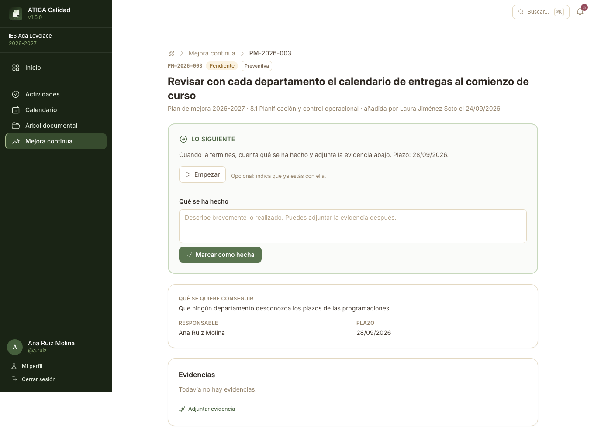

Quien es responsable abre la acción desde su tarea. Puede pulsar **Empezar** para indicar que ya está
con ella (opcional), y cuando la termina, contar **qué se ha hecho** y pulsar **Marcar como hecha**.
En **Evidencias** adjunta lo que lo demuestre (fotos, actas, documentos...), antes o después de
marcarla.

## Indicadores {#indicadores}

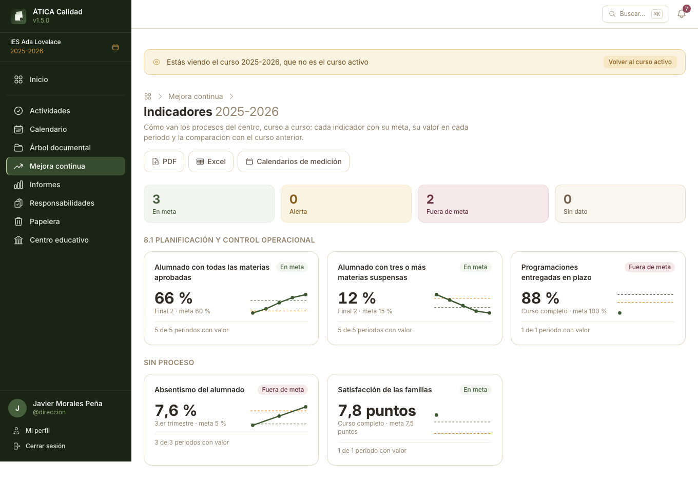

Un **indicador** mide cómo va un proceso del centro: el alumnado que promociona, el absentismo, la
satisfacción de las familias... Cada uno tiene su **meta** para el curso y, opcionalmente, un
**umbral de alerta**; con ellos, cada valor queda:

| Estado | Qué significa |
| --- | --- |
| **En meta** | Alcanza la meta (o no la supera, si menos es mejor). |
| **Alerta** | No llega a la meta, pero no pasa del umbral de alerta. |
| **Fuera de meta** | Pasa del umbral de alerta (o no llega a la meta, si no hay umbral). |
| **Sin dato** | Terminó el plazo para registrarlo y no se hizo. |

**Indicadores** (desde la portada, para quien ve todas las fichas) muestra el **cuadro** del curso
seleccionado en el menú lateral: una tarjeta por indicador, agrupadas por proceso, con su último valor,
su estado, una pequeña gráfica y el valor del curso anterior. Arriba, los recuentos por estado sirven
de filtro. Está pensado para proyectarlo en la reunión del equipo de calidad, y se descarga en PDF o
Excel (el mismo informe que [Informes → Cuadro de indicadores](04-informes.md#cuadro-de-indicadores)).

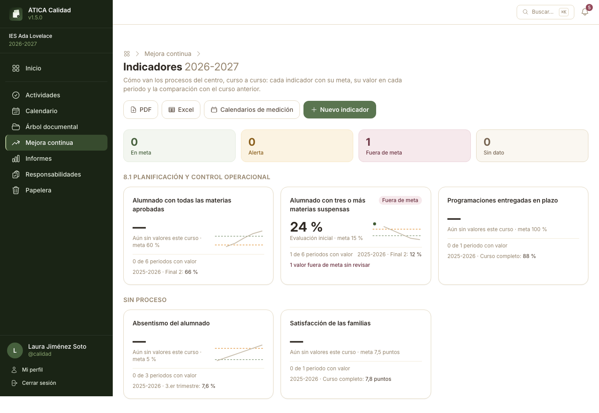

### Calendarios de medición {#calendarios-de-medicion}

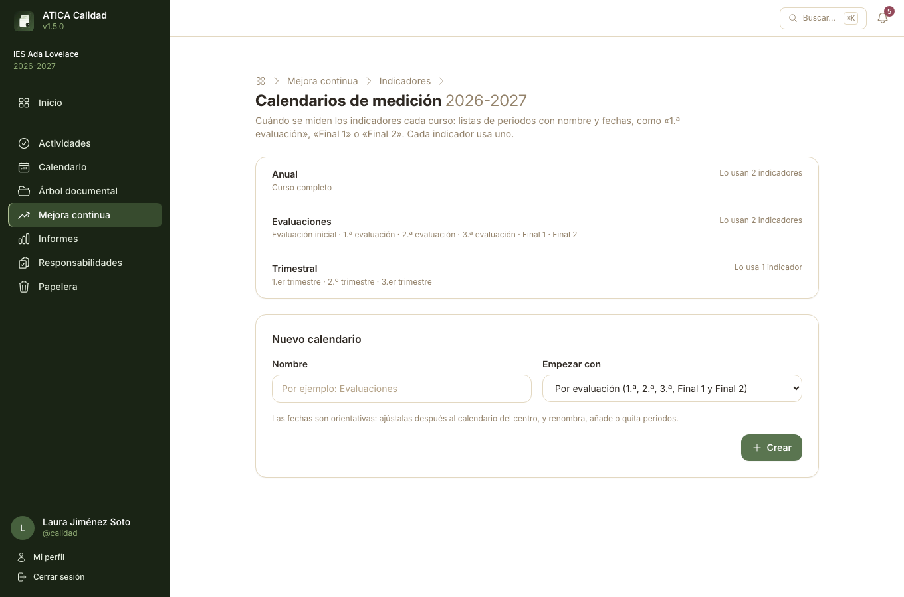

Antes de medir hay que decir **cuándo**. En **Indicadores → Calendarios de medición**, quien gestiona
crea para cada curso uno o varios calendarios: listas de **periodos** con su nombre y sus fechas. Se
empieza desde una plantilla —**por evaluación** (1.ª, 2.ª, 3.ª, Final 1 y Final 2), **por trimestre**,
**mensual** o **una vez por curso**— o en blanco, y después se ajusta al calendario del centro:

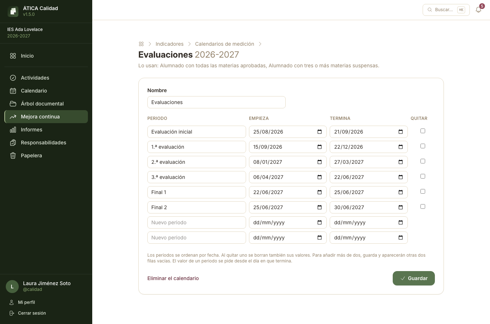

- se cambian el nombre y las fechas de cualquier periodo, se **añaden** periodos en las filas vacías
  (por ejemplo, una «Evaluación inicial») y se **quitan** marcando «Quitar»; los periodos quedan
  siempre ordenados por fecha;
- al quitar un periodo se borran también los valores que tuviera;
- un calendario que usa algún indicador no se puede eliminar.

Al empezar un curso nuevo sin calendarios, la página ofrece **Copiar del curso anterior**: copia sus
calendarios con las fechas un año después y da a cada indicador la misma meta, el mismo umbral y el
calendario copiado. Después solo queda revisar las fechas.

### Definir un indicador

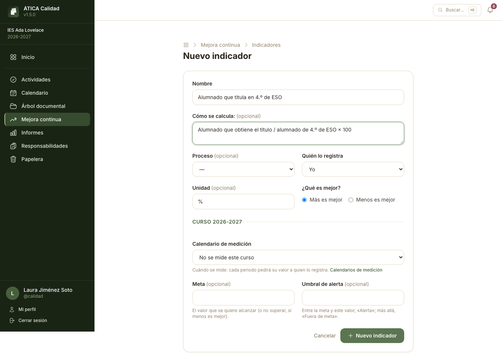

**Nuevo indicador** pide:

- el **nombre** y **cómo se calcula** (en palabras: «alumnado que promociona / alumnado matriculado
  × 100»);
- el **proceso** que mide, **quién lo registra** —un docente o un perfil de
  [Responsabilidades](06-responsabilidades.md)—, la **unidad** (%, puntos, días...) y **qué es mejor**:
  más o menos;
- para el curso activo: el **calendario de medición**, la **meta** y el **umbral de alerta**. Sin
  calendario, el indicador no se mide ese curso.

Al editarlo se puede desmarcar **Se sigue midiendo**: conserva su historia, pero deja de pedir
valores. La meta, el umbral y el calendario son de cada curso; el resto, del indicador.

### Registrar los valores

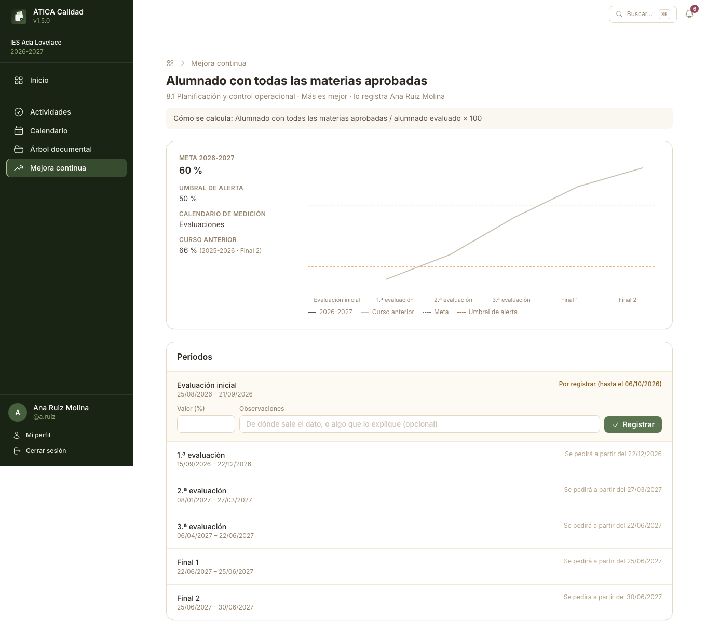

Cuando termina un periodo, quien registra el indicador tiene la tarea **Registrar** (en el panel
principal, la campana, el calendario y el recordatorio diario) hasta 15 días después (ajustable en
[Ajustes](#ajustes)); pasado ese plazo, el periodo consta como **Sin dato**. Desde la tarea llega a
la página del indicador, escribe el **valor** —con coma o con punto— y, si quiere, unas
**observaciones** sobre de dónde sale el dato. Un valor ya registrado se puede **corregir**.

La página muestra la meta y el umbral del curso, una gráfica con los valores del curso (en verde), los
del curso anterior en los mismos periodos (en gris) y las líneas de la meta y del umbral, y cada
periodo con su valor, su estado y quién lo registró.

### Un valor fuera de meta

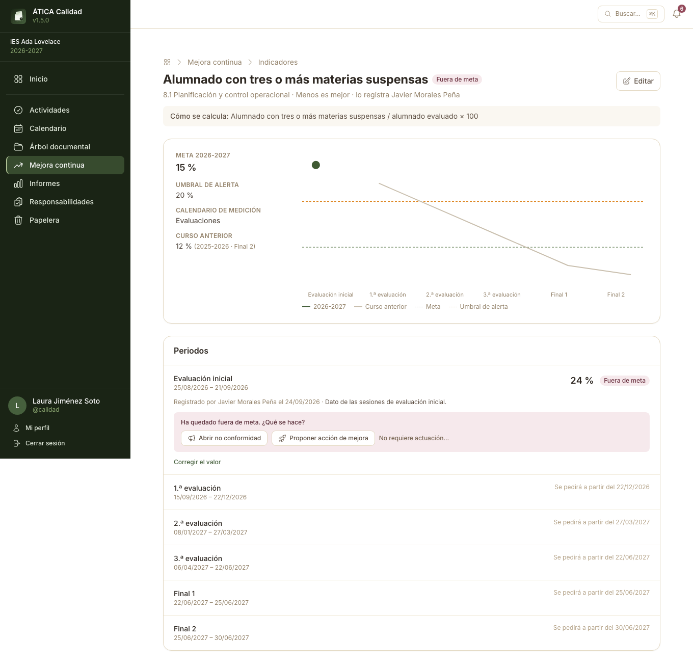

Cuando un valor queda **fuera de meta**, la coordinación de calidad recibe un aviso por correo y la
tarea **Fuera de meta**. En el periodo del indicador decide qué se hace:

- **Abrir no conformidad**: crea una incidencia con el origen «Indicador fuera de meta», el indicador,
  el periodo, el valor y la meta ya escritos, y la lleva a la ficha para clasificarla;
- **Proponer acción de mejora**: abre el formulario de una acción del
  [plan de mejora](#plan-de-mejora) con el proceso y lo que se quiere conseguir ya rellenos;
- **No requiere actuación**: se anota por qué (por ejemplo, «un grupo excepcional este curso»).

A partir de ahí, el periodo muestra lo que se abrió (con enlace) o la nota, y la tarea desaparece. Si
el valor se corrige después, vuelve a quedar pendiente de decidir.

## Auditoría interna {#auditoria-interna}

La auditoría interna comprueba, con una lista de puntos, que un proceso funciona como se ha
establecido. Cada curso tiene su **programa de auditorías**: qué se audita, cuándo y quién lo hace.
Lo que se encuentra se convierte en fichas de Mejora continua.

### El programa del curso

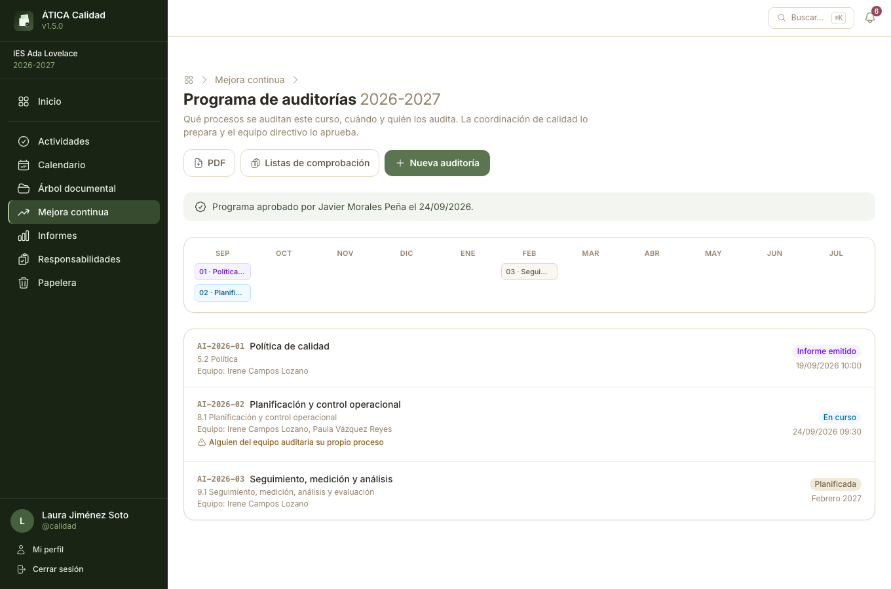

**Auditorías** (desde la portada, para quien ve todas las fichas) muestra el programa del curso
seleccionado en el menú lateral: una línea con los meses del curso y cada auditoría en el suyo, y
la lista con su código (`AI-AAAA-NN`), su alcance, su equipo, su estado y su fecha. El PDF del
programa se descarga desde aquí.

La coordinación de calidad lo prepara con **Nueva auditoría**:

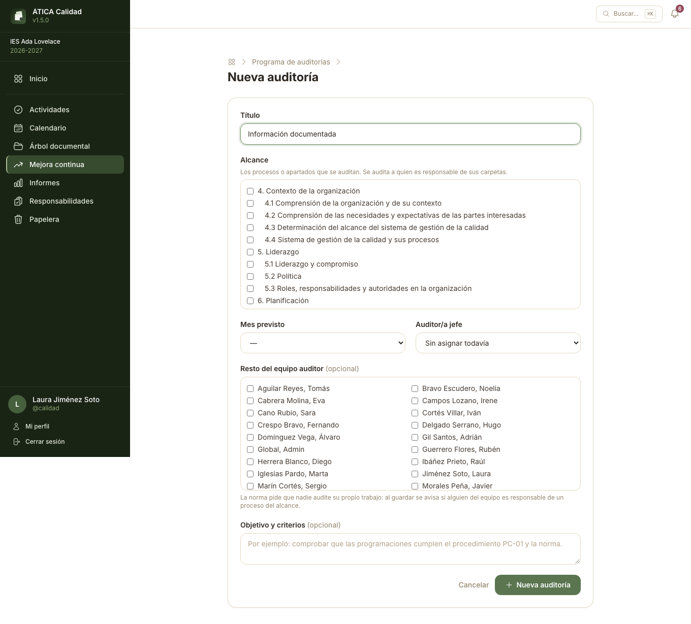

- el **título** y el **alcance**: los procesos o apartados del [árbol documental](07-arbol-documental.md)
  que se auditan. Se audita a quien es responsable de sus carpetas (las **personas auditadas**);
- el **mes previsto**, el **auditor/a jefe** y el **resto del equipo**;
- el **objetivo y los criterios** (opcional): contra qué se comprueba y para qué.

La norma pide que nadie audite su propio trabajo. Si alguien del equipo es responsable de un proceso
del alcance, se avisa al guardar y en la página de la auditoría, aunque no se impide:

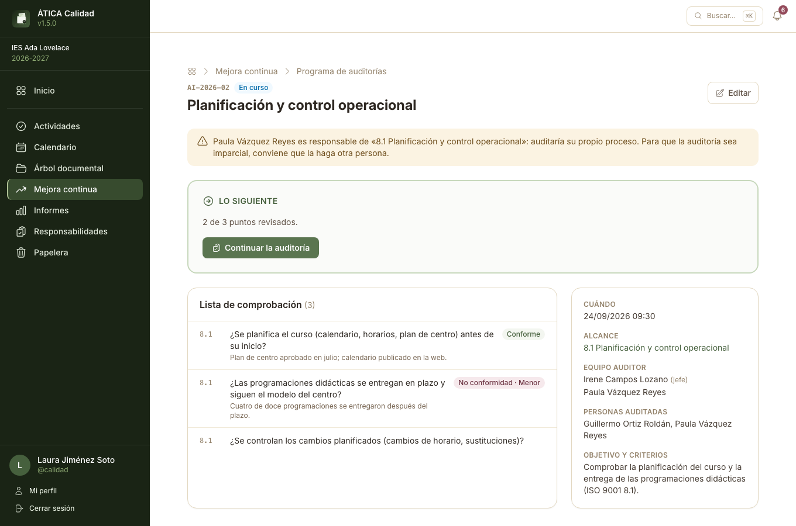

El **equipo directivo aprueba el programa** con un botón (le aparece como tarea mientras no lo
haga). Si después se añade o se quita una auditoría, el programa vuelve a quedar pendiente de
aprobar. Un curso nuevo sin auditorías puede empezar **copiando las del curso anterior**, un año
después y con el mismo equipo.

### Preparar la auditoría

Un mes antes de su fecha, el equipo auditor tiene la tarea **Auditoría** en el panel principal, la
campana, el calendario y el recordatorio diario. En **Preparar la auditoría** fija la **fecha y la
hora** —que aparecen en el calendario del equipo y de las personas auditadas— y la **lista de
comprobación**:

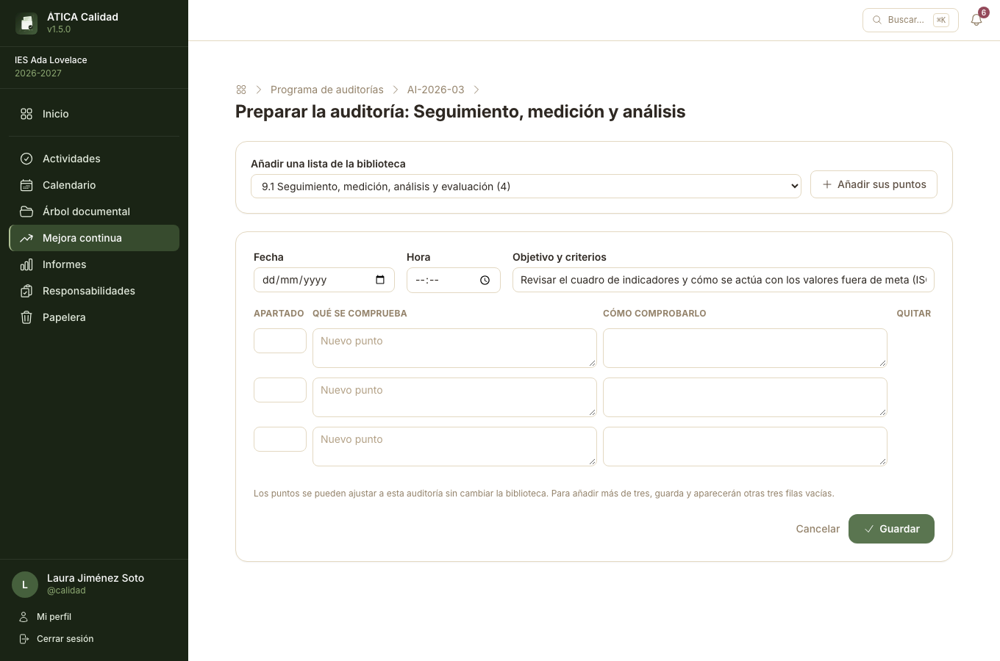

- **Añadir una lista de la biblioteca** copia sus puntos (se propone la del apartado auditado);
- después se ajustan a esta auditoría —apartado, qué se comprueba y cómo comprobarlo—, se añaden
  puntos en las filas vacías y se quitan con «Quitar», sin cambiar la biblioteca.

Con la fecha, el auditor/a jefe y al menos un punto, se puede **Empezar la auditoría**.

### Realizar la auditoría

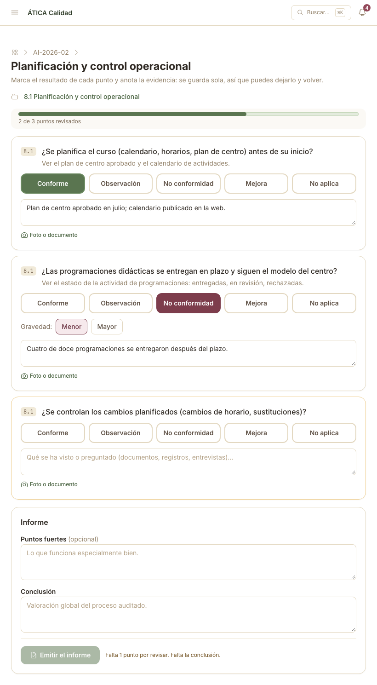

La pantalla está pensada para usarse con una tableta durante la auditoría. Cada punto tiene cinco
botones grandes:

| Resultado | Qué significa | Al emitir el informe |
| --- | --- | --- |
| **Conforme** | Se cumple. | — |
| **Observación** | Se cumple, pero podría dejar de hacerlo. | Ficha de observación |
| **No conformidad** | No se cumple (con su gravedad, menor o mayor). | Ficha de no conformidad |
| **Mejora** | Se cumple y podría ir mejor. | Ficha de oportunidad de mejora |
| **No aplica** | No procede en este proceso. | — |

Bajo cada punto se anota la **evidencia** (qué se ha visto o preguntado) y se adjuntan **fotos o
documentos**. Todo se guarda solo al pulsar o al salir del campo, así que se puede dejar y
volver. Arriba, el avance; el enlace del alcance abre sus documentos en el árbol documental.

Al final se escriben los **puntos fuertes** (opcional) y la **conclusión**, y se pulsa **Emitir el
informe** cuando todos los puntos tienen resultado.

### El informe y el cierre

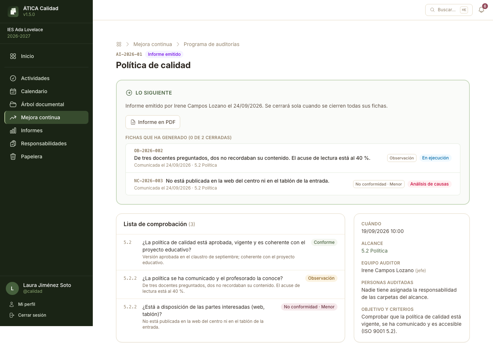

Al emitir el informe:

- cada **no conformidad**, **observación** o **mejora** se convierte en una ficha ya clasificada,
  con su código, el origen «Auditoría interna» y el proceso auditado; la no conformidad pasa al
  análisis de causas (con 15 días de plazo) y el resto, a ejecución;
- las **personas auditadas**, el equipo y la coordinación de calidad reciben el aviso por correo, y
  las personas auditadas pueden ver la auditoría;
- se genera el **informe en PDF** con el membrete del centro: alcance, equipo, personas auditadas,
  resumen por resultado, puntos fuertes, hallazgos, lista de comprobación y conclusión.

La auditoría se **cierra sola** cuando se cierran todas las fichas que generó (o al emitir el
informe, si no encontró nada que tratar). Mientras tanto, su página muestra cuántas quedan.

### Listas de comprobación

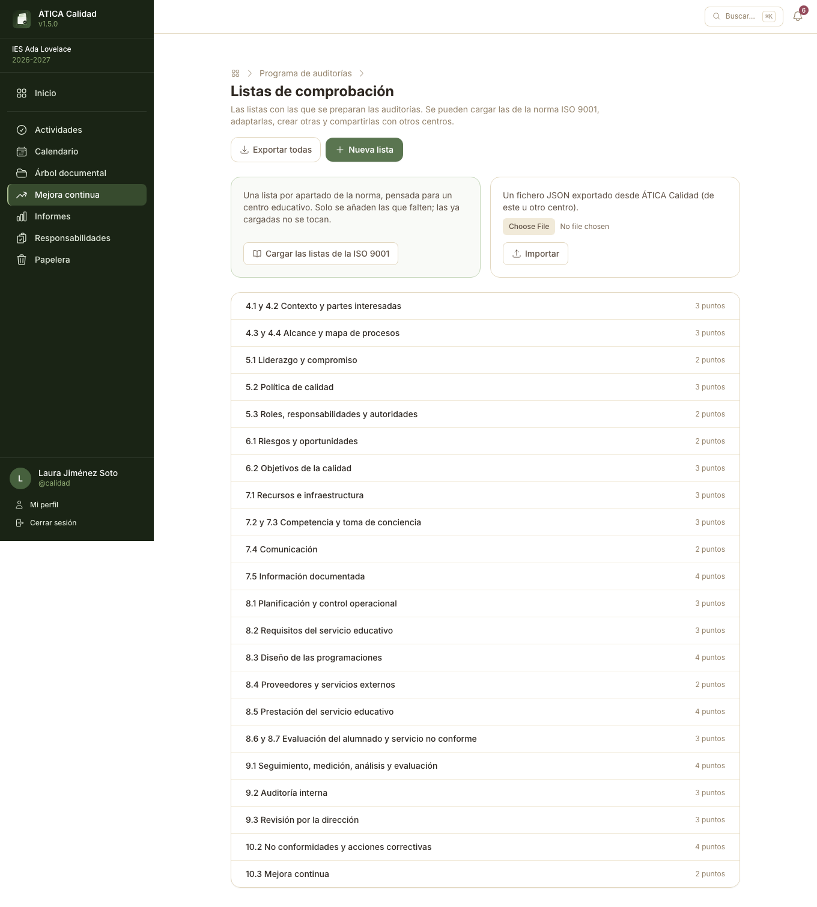

**Auditorías → Listas de comprobación** es la biblioteca del centro. **Cargar las listas de la ISO
9001** añade una por apartado de la norma, pensadas para un centro educativo (solo las que falten).
Cada lista se puede editar, crear desde cero o eliminar, y **exportar** e **importar** en JSON
para compartirlas con otros centros; al importar, una lista con el nombre de otra ya existente
recibe un número detrás.

## Revisión por la dirección {#revision-por-la-direccion}

Una vez al año (o cuando haga falta), el equipo directivo repasa cómo va el sistema de calidad y
decide qué cambiar: es la **revisión por la dirección** (apartado 9.3 de la ISO 9001). La aplicación
reúne lo que sabe del periodo; en la reunión se anota lo demás, las conclusiones y las decisiones.

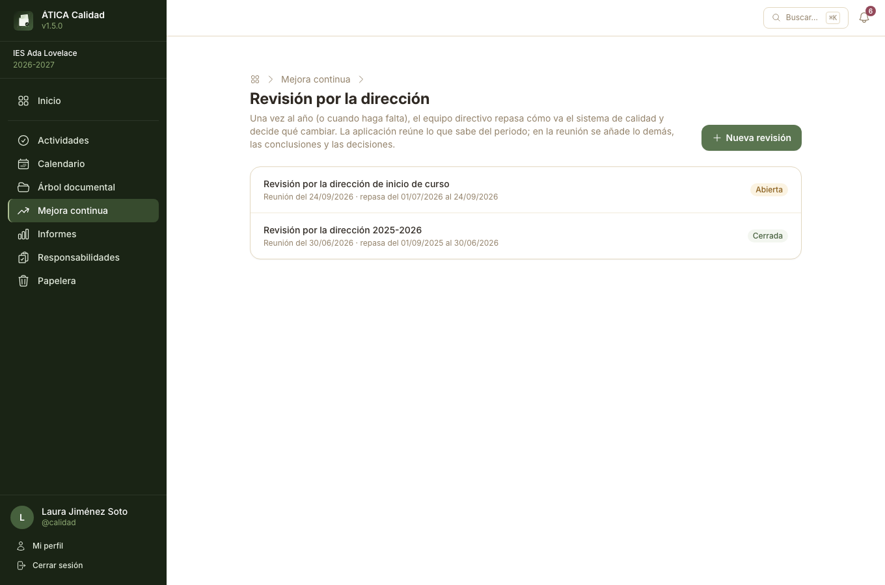

**Mejora continua → Revisión por la dirección** muestra las revisiones del centro, la más reciente
primero. La coordinación de calidad o el equipo directivo pulsan **Nueva revisión** e indican la
fecha de la reunión y el **periodo** que repasa, que por defecto va desde el día siguiente al final
de la revisión anterior (o desde el 1 de septiembre, si es la primera) hasta hoy.

### Lo que reúne la aplicación

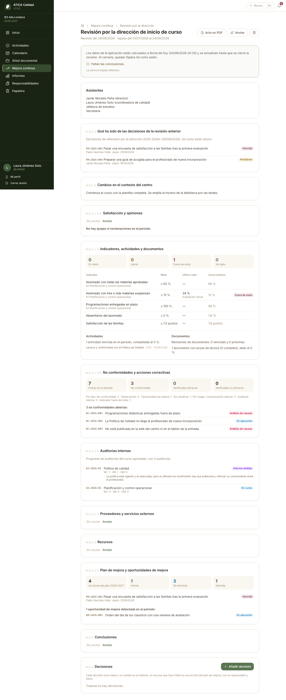

La página de la revisión sigue el orden de la norma (cada bloque lleva su apartado en gris) y
reúne, para el periodo:

- **Qué ha sido de las decisiones de la revisión anterior**, con su estado actual.
- Las **quejas y reclamaciones** (fichas con ese origen).
- El **cuadro de indicadores** del curso: cuántos están en meta, en alerta, fuera de meta o sin dato,
  con su meta, su último valor y el del curso anterior.
- Las **actividades** vencidas en el periodo y cuánto se han completado (solo en el curso activo),
  las **revisiones de documentos** vencidas y próximas y el **acuse de lectura**.
- Las **fichas** del periodo por tipo y por origen, las no conformidades verificadas como eficaces o
  no, y las **no conformidades abiertas** (también las anteriores al periodo).
- Las **auditorías internas** planificadas en el periodo, con sus hallazgos y su conclusión.
- El **plan de mejora** del curso (hechas, sin terminar, vencidas) y las **oportunidades de
  mejora** detectadas.

Cada elemento enlaza con su ficha, acción o auditoría. Mientras la revisión está abierta, estos datos
se calculan de nuevo cada vez que se abre la página.

### Anotar la reunión

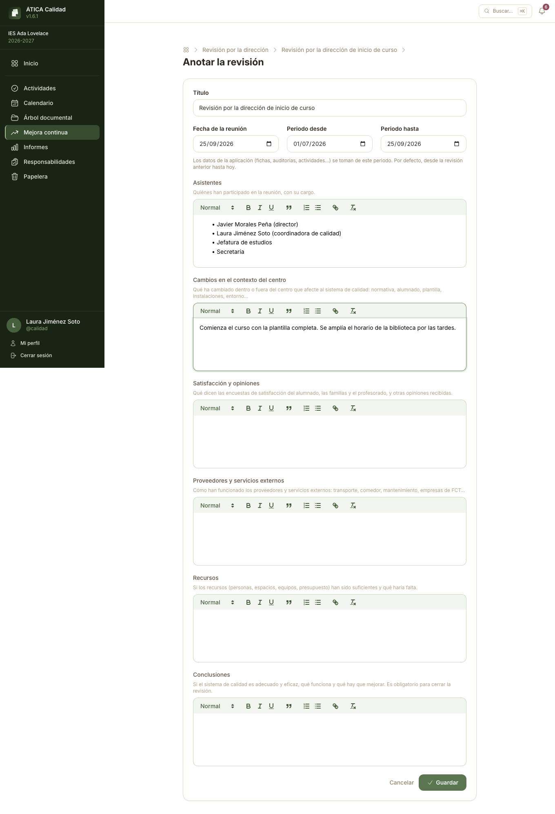

**Anotar** abre los apartados que la aplicación no puede saber: **asistentes**, **cambios en el
contexto** del centro, **satisfacción y opiniones** (encuestas, sugerencias), **proveedores y
servicios externos**, **recursos** y las **conclusiones** sobre si el sistema es adecuado y eficaz.
En la página, cada apartado sin anotar tiene su enlace **Anotar**.

### Las decisiones

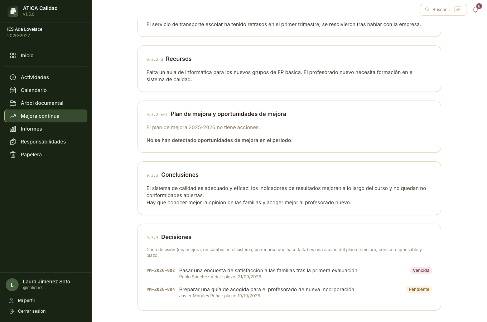

Cada decisión —una mejora, un cambio en el sistema, un recurso que hace falta— es una **acción del
plan de mejora**: **Añadir decisión** abre el formulario del plan (con el aviso «Decisión de…»),
y al guardarla se vuelve a la revisión. Llega como tarea a su responsable, se sigue en el plan como
cualquier otra y su página indica en qué revisión se decidió. La revisión siguiente muestra cómo han
ido.

### Cerrar la revisión y el acta

Cuando la reunión ya se ha celebrado y las conclusiones están escritas, el **equipo directivo**
pulsa **Cerrar la revisión**. Al cerrarla, los datos de la aplicación **quedan fijados** tal como
estaban ese día (lo que ocurra después ya no los cambia) y la revisión deja de poder modificarse o
eliminarse. Las decisiones, en cambio, siguen mostrando su estado actual.

**Acta en PDF** descarga el acta con el membrete del centro: los datos de la reunión, las entradas
de la revisión y sus salidas (conclusiones y decisiones). Mientras la revisión está abierta, sale
con la marca de borrador.

Una revisión abierta se puede eliminar; sus decisiones se quedan en el plan de mejora.

## Ajustes

En **Ajustes**, a nivel global o de centro:

- **Mejora continua → Días hasta la verificación de eficacia** (30 por defecto): los días que se
  dejan pasar, desde que se terminan las acciones de una no conformidad, antes de proponer
  comprobar si han funcionado.
- **Mejora continua → Días para registrar el valor de un indicador** (15 por defecto): desde que
  termina un periodo de medición, el plazo para registrar su valor antes de que conste como «Sin
  dato».
- **Avisos por correo → Avisos de Mejora continua**: los correos de «te toca» (clasificar, analizar,
  hacer una acción, verificar) y los de «tu incidencia se ha resuelto». También se puede desactivar
  a nivel personal; quien lo desactiva deja de ver también sus tareas de Mejora continua en el
  recordatorio diario.
- **Avisos por correo → Recordatorio de actividad pendiente de completar** y sus **días de
  preaviso**: el recordatorio diario, que incluye las tareas de Mejora continua con plazo.

## Permisos de un vistazo {#permisos-de-un-vistazo}

| Puede... | Docente | Auditor/a interno/a | Responsable de calidad | Equipo directivo / Admin. del centro | Admin. de la plataforma |
| --- | :-: | :-: | :-: | :-: | :-: |
| Comunicar incidencias y seguir las propias | ✅ | ✅ | ✅ | ✅ | ✅ |
| Analizar las causas y hacer las acciones que se le asignen | ✅ | ✅ | ✅ | ✅ | ✅ |
| Registrar los valores de los indicadores de los que es responsable | ✅ | ✅ | ✅ | ✅ | ✅ |
| Ver todas las fichas, el plan de mejora, los indicadores y sus informes | — | ✅ | ✅ | ✅ | ✅ |
| Clasificar, descartar, asignar, verificar y cerrar | — | — | ✅ | ✅ | ✅ |
| Añadir, editar y eliminar acciones del plan de mejora | — | — | ✅ | ✅ | ✅ |
| Definir indicadores y calendarios de medición, registrar cualquier valor y decidir sobre los que quedan fuera de meta | — | — | ✅ | ✅ | ✅ |
| Ver el programa de auditorías y sus informes | — | ✅ | ✅ | ✅ | ✅ |
| Preparar y realizar una auditoría y emitir su informe | Si está en su equipo | Si está en su equipo | ✅ | ✅ | ✅ |
| Ver una auditoría en la que se le audita | ✅ | ✅ | ✅ | ✅ | ✅ |
| Programar auditorías y gestionar las listas de comprobación | — | — | ✅ | ✅ | ✅ |
| Aprobar el programa de auditorías | — | — | — | ✅ | ✅ |
| Ver las revisiones por la dirección y su acta | — | ✅ | ✅ | ✅ | ✅ |
| Crear una revisión por la dirección, anotarla y añadir sus decisiones | — | — | ✅ | ✅ | ✅ |
| Cerrar una revisión por la dirección | — | — | — | ✅ | ✅ |
