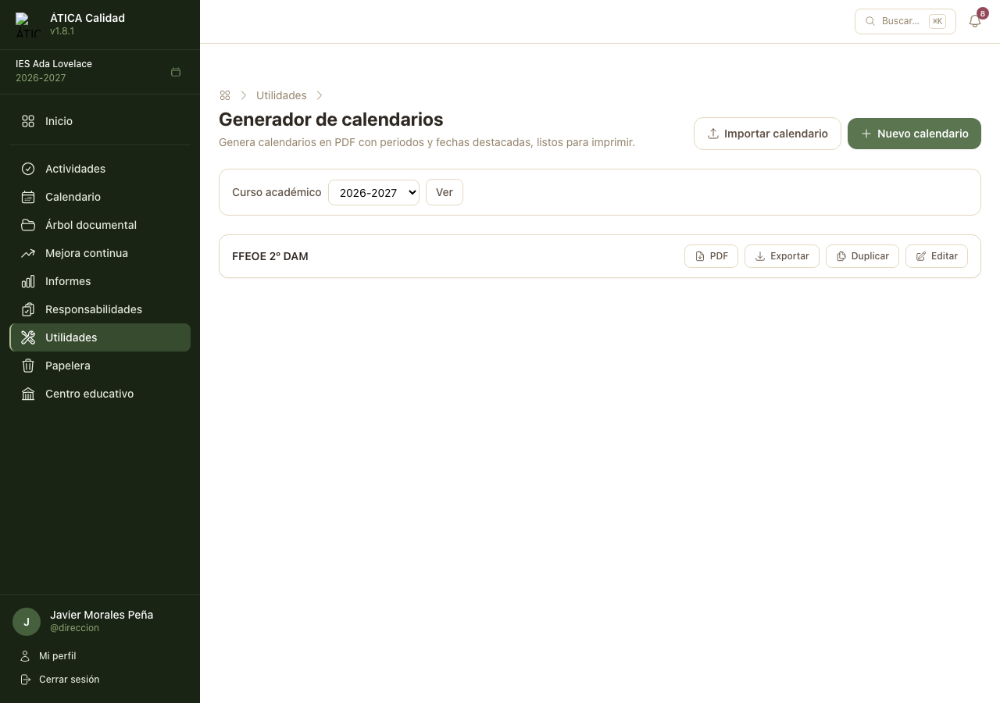
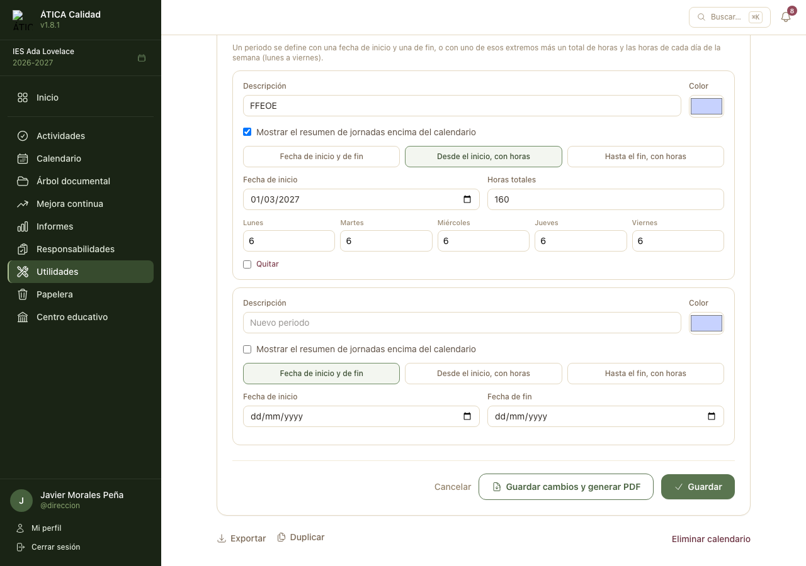
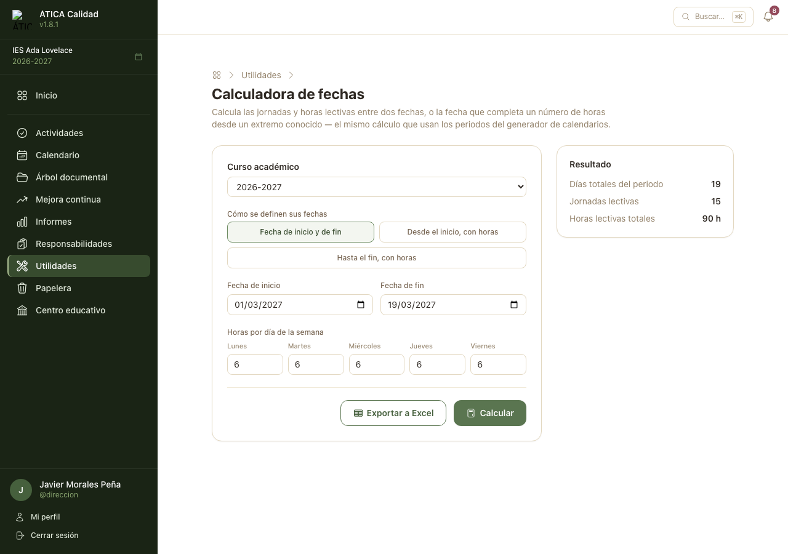

# Utilidades

La sección **Utilidades** reúne herramientas personales que no forman parte del sistema de gestión
de la calidad: nada de lo que hay aquí se audita ni se comparte con nadie más. Todo docente con un
centro activo puede usarlas, sin necesidad de ningún perfil especial.

## Generador de calendarios

Genera calendarios propios en PDF, con periodos y fechas destacadas — pensado, por ejemplo, para
llevar el seguimiento de una FFEOE o de cualquier otro periodo con un patrón de horas semanal. No
tiene relación con el [calendario del centro](03-calendario.md): es completamente personal, cada
calendario lo ve y lo edita únicamente quien lo ha creado.

### Crear y editar un calendario

Un calendario tiene:

- un **título** y, si se quiere, una **descripción** con texto enriquecido (negrita, listas,
  enlaces y alineación de párrafos), que aparece justo debajo del encabezado;
- el **curso académico** al que pertenece;
- una **fecha de inicio y de fin**, opcionales: si se dejan en blanco, se calculan solas a partir de
  sus periodos y fechas individuales;
- el **color** de los días no lectivos y el de los fines de semana (con un valor por defecto para
  cada uno);
- el **formato de página** (vertical o apaisado) y el **tamaño de la letra** (entre el 50 % y el
  200 % del tamaño por defecto de ese formato);
- si se muestran o no el **encabezado**, el **pie de página** y las **horas de cada día** —
  ocultarlos deja más espacio para el propio calendario.

### Fechas individuales

Días sueltos que se quieren destacar, cada uno con su propio color y descripción (p. ej. una
entrega o una convocatoria). Si dos entradas comparten la misma fecha, se les aplica el mismo color
de fondo automáticamente al guardar, pero cada descripción se sigue mostrando por separado en el
margen del mes.

### Periodos

Un periodo resalta un rango de días con un color propio, de tres formas posibles:

- **Fecha de inicio y de fin**: un rango de fechas fijo.
- **Desde el inicio, con horas**: se indica la fecha de inicio, un total de horas y las horas que
  corresponden a cada día de la semana (lunes a viernes); el calendario calcula solo la fecha de
  fin, repartiendo esas horas día a día y saltando fines de semana y días no lectivos del curso.
- **Hasta el fin, con horas**: igual que el anterior, pero calculando hacia atrás la fecha de
  inicio a partir de la fecha de fin.

Un periodo con horas puede mostrar, además, un **resumen de jornadas** justo encima del calendario
(cuántas jornadas y de cuántas horas cada una).

### Generar y compartir el PDF

El botón **PDF** de cada calendario lo descarga en su formato actual; desde el formulario de
edición, **Guardar cambios y generar PDF** hace las dos cosas de una vez. Si el centro tiene
configurada una plantilla propia para el generador de calendarios (**Ajustes del centro → Plantillas
de informes**), se usa como membrete; si no, se usa la general del centro.

### Duplicar, exportar e importar

- **Duplicar** crea una copia completa del calendario (con sus fechas y periodos), con «(copia)»
  añadido al título — útil para reutilizar uno de un curso anterior como punto de partida.
- **Exportar** descarga el calendario como un fichero **JSON** que no incluye el centro ni el curso
  académico, para poder llevarlo a otro curso o compartirlo con otro docente.
- **Importar calendario** crea un calendario nuevo a partir de uno de esos ficheros, en el curso
  académico que se elija al importarlo.

## Calculadora de fechas

Resuelve directamente, sin crear ni guardar ningún calendario, la misma cuenta que hace un periodo
con horas del generador de calendarios:

- **Fecha de inicio y de fin**: cuántas jornadas y horas lectivas hay entre dos fechas dadas, con un
  patrón de horas semanal.
- **Desde el inicio, con horas**: qué fecha de fin corresponde a un total de horas, empezando en una
  fecha conocida.
- **Hasta el fin, con horas**: qué fecha de inicio corresponde a un total de horas, terminando en
  una fecha conocida.

En los tres casos se indican el **curso académico** (para saber qué días no lectivos aplican) y las
**horas de cada día de la semana** (lunes a viernes). El resultado muestra la fecha calculada (si
aplica), los días totales del periodo, las jornadas lectivas y las horas lectivas totales, y se
puede descargar en **Excel** con el detalle de cada jornada.

